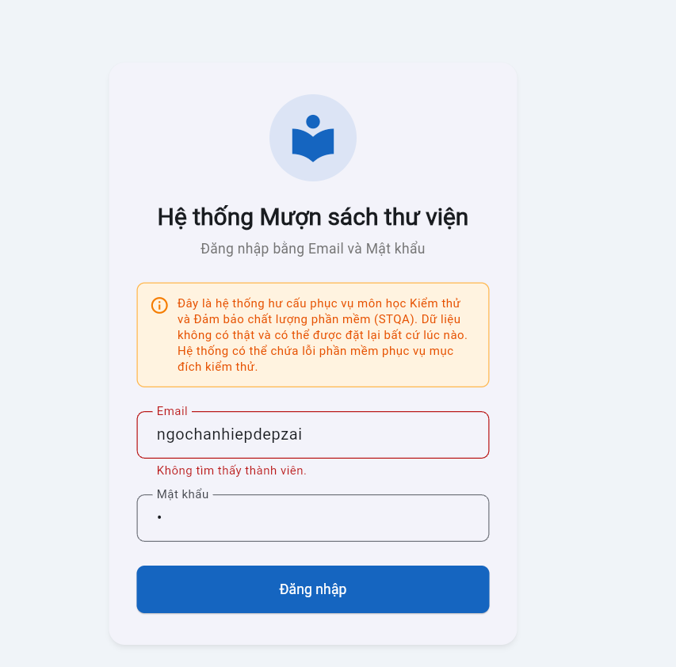

# Bug Reports — Báo cáo lỗi

> **Hướng dẫn**: Tạo 1 mục bug cho mỗi TC có kết quả **Fail**.
> Xem [examples/sample-bug-report.md](../examples/sample-bug-report.md) để hiểu cách viết bug report tốt.
> Mỗi bug cần: tiêu đề mô tả hành vi lỗi, bước tái hiện, expected vs actual, severity + giải thích.

| Thông tin | |
|---|---|
| **Nhóm** | Nhóm 10 |
| **Ngày báo cáo** | 04/06/2026 |

---

## BUG-01

| Thuộc tính | Chi tiết |
|-----------|---------|
| **Mã lỗi** | BUG-01 |
| **TC liên quan** | TC-05 |
| **REQ liên quan** | REQ-01 |
| **Mức độ** | High |
| **Người phát hiện** | Ngô Chấn Hiệp - 23BA14102 |
| **Ngày phát hiện** | 27/05/2026 |
| **Trạng thái** | Open |

**Tiêu đề:**
Chức năng đăng nhập phân biệt chữ hoa,thường đối với email dẫn đến thông báo sai : Không tìm thấy thành viên

**Môi trường:**
- Trình duyệt: Chrome 
- Hệ điều hành: Window 11
- Ngôn ngữ giao diện: Tiếng Việt

**Điều kiện tiên quyết:**
Trang đăng nhập đã mở, hệ thống đã có sẵn tài khoản thành viên hợp lệ với email viết thường ( ví dụ: librarian@library.com )

**Bước tái hiện:**
1. Truy cập vào trang đăng nhập của web
2. Tại ô email, nhập email hợp lệ nhưng viết hoa chữ cái đầu tiên ( ví dụ : librarian@library.com )
3. Tại ô mật khẩu , nhập mật khẩu chính xác của email đó
4. Ấn đăng nhập

**Kết quả mong đợi:**
Hệ thống không phân biệt chữ hoa hay chữ thường đối với email , hệ thống tự động đổi chuỗi email về chữ thường và đăng nhập thành công rồi chuyển sang trang chủ 

**Kết quả thực tế:**
Hệ thống phân biệt chữ hoa,thường và không nhận diện được tài khoản rồi hiển thị thông báo lỗi sai thực tế : Không tìm thấy thành viên

**Tác động:**
Vi phạm quy tắc trải nghiệm người dùng cốt lõi. Người dùng trên thiết bị di động (thường tự động viết hoa chữ cái đầu do bàn phím) hoặc người dùng vô tình bật CapsLock sẽ không thể đăng nhập được dù tài khoản đã đăng kí thành công , gây khó chịu và nghĩ hệ thống bị lỗi dữ liệu

**Minh chứng:**

**Đề xuất xử lý:**

---

## BUG-02

| Thuộc tính | Chi tiết |
|-----------|---------|
| **Mã lỗi** | BUG-02 |
| **TC liên quan** | TC-07 |
| **REQ liên quan** | REQ-01 |
| **Mức độ** | Medium |
| **Người phát hiện** | Ngô Chấn Hiệp |
| **Ngày phát hiện** | 28/05/2026 |
| **Trạng thái** | Open |

**Tiêu đề:**
Hệ thống thông báo lỗi không chính xác và sai logic xác thực khi người dùng nhập sai định dạng email tại màn hình đăng nhập

**Bước tái hiện:**
1. Truy cập vào màn hình đăng nhập của hệ thống
2. Nhập email sai định dạng (vdu: ngochanhiepdepzai), nhập mật khẩu hợp lệ bất kỳ và nhấn nút đăng nhập

**Kết quả mong đợi:**
- Hệ thống cần thực hiện kiểm tra định dạng email trước khi kiểm tra trong dâtbase
- Hiển thị thông báo: Email không đúng định dạng

**Kết quả thực tế:**
Hệ thống hiển thị thông báo: Không tìm thấy thành viên 

**Tác động:**
Gây bối rối và hiểu lầm cho người dùng. Người dùng sẽ tưởng email chưa được đăng ký hệ thống hoặc tưởng mình chưa nhập email mặc dù họ đã nhập nhưng chỉ bị sai định dạng

**Minh chứng:**

**Đề xuất xử lý:**

---

## BUG-03

| Thuộc tính | Chi tiết |
|-----------|---------|
| **Mã lỗi** | BUG-03 |
| **TC liên quan** | TC-08 , TC-11 |
| **REQ liên quan** | REQ-07 |
| **Mức độ** | High |
| **Người phát hiện** | Ngô Chấn Hiệp - 23BA14102 |
| **Ngày phát hiện** | 29/05/2026 |
| **Trạng thái** | Open |

**Tiêu đề:**
Lỗi logic xác thực định dạng Email: Email hợp lệ bị chặn báo lỗi, email không hợp lệ (thiếu dấu .) lại được chấp nhận

**Môi trường:**
- Trình duyệt: Chrome 
- Hệ điều hành: Window 11
- Ngôn ngữ giao diện: Tiếng Việt

**Điều kiện tiên quyết:**
Tài khoản đăng nhập đang có quyền Thủ thư. Trang Thêm thành viên mới đã được mở

**Bước tái hiện:**
1. Truy cập vào giao diện Thêm thành viên mới
2. Trường hợp 1 (Tái hiện TC-08): Nhập đầy đủ thông tin hợp lệ với Email chuẩn định dạng là ngohiep010605@gmail.com , nhấn nút Thêm thành viên
3. Trường hợp 2 (Tái hiện TC-05): Nhập đầy đủ thông tin với Email sai định dạng (có @ nhưng thiếu dấu . ở domain) là ghiep342@gmailcom , nhấn nút Thêm thành viên

**Kết quả mong đợi:**
1. Trường hợp 1: Thành viên được tạo thành công, hệ thống lưu dữ liệu và báo thành công
2. Trường hợp 2: Hệ thống phải chặn lại, không cho tạo và hiển thị thông báo lỗi "Email không hợp lệ"

**Kết quả thực tế:**
1. Trường hợp 1: Hệ thống chặn lại không cho tạo và hiển thị thông báo lỗi "Email không hợp lệ".
2. Trường hợp 2: Hệ thống tạo thành viên mới thành công với email sai định dạng ghiep342@gmailcom

**Tác động:**
Vi phạm quy tắc nghiệp vụ cốt lõi về kiểm tra định dạng dữ liệu (Email validation). Khiến người dùng nhập đúng không thể đăng ký, còn người dùng nhập sai lại tạo được tài khoản rác vào database.

**Minh chứng:**

**Đề xuất xử lý:**

---

## BUG-04

| Thuộc tính | Chi tiết |
|-----------|---------|
| **Mã lỗi** | BUG-04 |
| **TC liên quan** | TC-13(ảnh hưởng bởi TC-08) |
| **REQ liên quan** | REQ-07 |
| **Mức độ** | High |
| **Người phát hiện** | `Ngô Chấn Hiệp |
| **Ngày phát hiện** | 29/05/2026 |
| **Trạng thái** | Open |

**Tiêu đề:**
Thêm thành viên bằng email đã tồn tại hiển thị sai thông báo lỗi (Hiển thị "Email không hợp lệ" thay vì "Email đã tồn tại")

**Môi trường:**
- Trình duyệt: Chrome 
- Hệ điều hành: Window 11 
- Ngôn ngữ giao diện: Tiếng Việt

**Điều kiện tiên quyết:**
1. Tài khoản đăng nhập đang có quyền Thủ thư
2. Trên hệ thống đã tồn tại sẵn một tài khoản có email là dam.tran@email.com (đây là email đúng định dạng)

**Bước tái hiện:**
1. Truy cập vào giao diện Thêm thành viên mới

2. Nhập các thông tin Họ và tên, Số điện thoại hợp lệ

3. Tại phần email, nhập email đã tồn tại trên hệ thống : dam.tran@email.com

4. Nhấn nút Thêm thành viên

**Kết quả mong đợi:**
Hệ thống kiểm tra trùng lặp, ngăn chặn việc tạo tài khoản trùng và hiển thị thông báo lỗi rõ ràng: Email đã tồn tại trên hệ thống

**Kết quả thực tế:**
Hệ thống ngăn chặn không cho tạo tài khoản, nhưng hiển thị thông báo lỗi: Email không hợp lệ

**Tác động:**
Vi phạm quy tắc thông báo lỗi nghiệp vụ SRS. Thông báo sai lệch làm người dùng/thủ thư hiểu lầm rằng định dạng email của họ bị sai, thay vì biết rằng email này đã được đăng ký trước đó

**Minh chứng:**

**Đề xuất xử lý:**

---

## BUG-05

| Thuộc tính | Chi tiết |
|-----------|---------|
| **Mã lỗi** | BUG-05 |
| **TC liên quan** | TC-10 |
| **REQ liên quan** | REQ-07 |
| **Mức độ** | Low |
| **Người phát hiện** | Ngô Chấn Hiệp |
| **Ngày phát hiện** | 29/05/2026 |
| **Trạng thái** | Open |

**Tiêu đề:**
Chức năng Thêm thành viên chỉ hiển thị thông báo lỗi của phần "Họ và tên" khi để trống toàn bộ form dữ liệu.

**Môi trường:**
- Trình duyệt: Chrome 
- Hệ điều hành: Window 11
- Ngôn ngữ giao diện: Tiếng Việt

**Điều kiện tiên quyết:**
Tài khoản đăng nhập đang có quyền Thủ thư. Trang Thêm thành viên mới đã được mở và các ô nhập liệu đang trống.

**Bước tái hiện:**
1. Để trống toàn bộ các thông tin: Họ và tên, Email, Số điện thoại

2. Nhấn Thêm thành viên

**Kết quả mong đợi:**
Hệ thống chặn lại và hiển thị thông báo lỗi/cảnh báo đỏ cho tất cả các trường bắt buộc đang bị bỏ trống (Họ và tên, Email, Số điện thoại) để người dùng biết và điền một lần

**Kết quả thực tế:**
Hệ thống chỉ hiển thị duy nhất một dòng thông báo lỗi: "Họ và tên không được để trống". Các trường Email và Số điện thoại không hề hiển thị cảnh báo lỗi dù cũng đang bị bỏ trống

**Tác động:**
Làm giảm trải nghiệm người dùng (UX). Người dùng sẽ phải bấm nút "Thêm thành viên" nhiều lần (sửa xong lỗi này mới nhìn thấy lỗi tiếp theo) gây mất thời gian và khó chịu.

**Minh chứng:**

**Đề xuất xử lý:**

---
## BUG-06

| Attribute           | Details                |
| ------------------- | ---------------------- |
| **Bug ID**          | BUG-06                 |
| **Related TC**      | TC-08                  |
| **Related REQ**     | REQ-03                 |
| **Severity**        | Medium                 |
| **Reporter**        | Lê Đắc Duy - 23BA14084 |
| **Date Discovered** | 02/06/2026             |
| **Status**          | Open                   |

**Title:**
Search function does not support Vietnamese keywords without accents

**Environment:**

* Browser: Chrome
* OS: Windows 11
* Interface Language: Vietnamese

**Prerequisites:**
The user has logged in successfully and is currently on the `Books` tab. The book list contains Vietnamese book titles with accents, such as `Lập trình Flutter cơ bản` or `Kiểm thử phần mềm nhập môn`.

**Reproduction Steps:**

1. Access the system website: https://stqa.rbc.vn.
2. Log in with a valid account.
3. Open the `Books` tab.
4. Enter a Vietnamese keyword without accents, such as `lap trinh`, in the search box.
5. Observe the displayed result.
6. Clear the search box.
7. Enter another keyword without accents, such as `kiem thu` or `nhap mon`.
8. Observe the displayed result again.

**Expected Result:**
The system should return matching books even when the user enters Vietnamese keywords without accents. For example, searching `lap trinh` should still find books containing `Lập trình`.

**Actual Result:**
The system does not display any matching books when the Vietnamese keyword is entered without accents.

**Impact:**
This reduces search usability for Vietnamese users. Many users may type Vietnamese keywords without accents, but the system cannot find existing books even though the books are available in the list.

**Evidence:**

**Proposed Fix:**

* Normalize Vietnamese text before searching.
* Remove accents from both the search keyword and book title/author before comparison.
* Support accent-insensitive search so that `lap trinh` can match `Lập trình`.
* Add test cases for searching Vietnamese book titles with and without accents.

---

## BUG-07

| Attribute           | Details                |
| ------------------- | ---------------------- |
| **Bug ID**          | BUG-07                 |
| **Related TC**      | TC-13, TC-14           |
| **Related REQ**     | REQ-03                 |
| **Severity**        | Medium                 |
| **Reporter**        | Lê Đắc Duy - 23BA14084 |
| **Date Discovered** | 02/06/2026             |
| **Status**          | Open                   |

**Title:**
Category filter does not return books when entering a valid category keyword

**Environment:**

* Browser: Chrome
* OS: Windows 11
* Interface Language: Vietnamese

**Prerequisites:**
The user has logged in successfully and is currently on the `Books` tab. The system displays available categories such as `Công nghệ`, `Giáo dục`, `Kinh tế`, `Kỹ năng mềm`, `Quản trị`, and `Văn học`.

**Reproduction Steps:**

1. Access the system website: https://stqa.rbc.vn.
2. Log in with a valid account.
3. Open the `Books` tab.
4. Click the category filter field.
5. Enter a valid category keyword such as `Công`.
6. Observe the displayed book list.
7. Clear the category filter field.
8. Enter another valid category keyword such as `Kinh`, `Văn`, or `Giáo`.
9. Observe the displayed book list again.

**Expected Result:**
The system should display books that belong to the matching category. For example, entering `Công` should display books in the `Công nghệ` category, and entering `Kinh` should display books in the `Kinh tế` category.

**Actual Result:**
The system does not display any books when entering valid category keywords in the category filter field.

**Impact:**
Users cannot filter books by category even though valid categories are available. This makes the category filter function ineffective and does not meet the search/filter requirement.

**Evidence:**

**Proposed Fix:**

* Update the category filter logic to compare user input with available category names.
* Support partial matching for valid category keywords.
* Normalize Vietnamese text and letter case before filtering.
* Ensure books are displayed when the entered keyword matches an existing category.
* Add test cases for valid category keywords such as `Công`, `Kinh`, `Văn`, and `Giáo`.

---

## BUG-08

| Thuộc tính | Chi tiết |
|-----------|---------|
| **Mã lỗi** | BUG-08 |
| **TC liên quan** | TC-02 |
| **REQ liên quan** | REQ-04 |
| **Mức độ** | **High** — Violates core business rules by allowing members to borrow books beyond the maximum limit, leading to system inventory discrepancies|
| **Người phát hiện** | Nguyễn Văn Hoàng 23BA14122 |
| **Ngày phát hiện** | 05/06/2026 |
| **Trạng thái** | Open |

**Tiêu đề:**
System allows member to borrow 4 books concurrently (Off-by-one boundary error on the limit of 3 books)

**Môi trường:**
- Trình duyệt: Chrome Version 148.0.7778.217
- Hệ điều hành: Windows 11
- Ngôn ngữ giao diện: Tiếng Việt

**Điều kiện tiên quyết:**
- Member account `"ba.nguyen@email.com"` is logged in.
- The account currently has exactly 1 active borrowed book record in the system (according to Seed Data).

**Bước tái hiện:**
1. Navigate to the "Books" tab.
2. Click the `(+)` button to borrow book `BOOK002` (Total active borrows = 2).
3. Click the `(+)` button to borrow book `BOOK004` (Total active borrows = 3).
4. Attempt to borrow a 4th book (`BOOK005`) by clicking its `(+)` button.

**Kết quả mong đợi:**
At step 4, the system must block the action and display a clear error message stating: "Đã đạt giới hạn 3 cuốn sách" (Maximum limit of 3 books reached) to prevent the 4th book from being borrowed.

**Kết quả thực tế:**
At step 4, the system allows the borrow action for `BOOK005` to process successfully. The member's total active borrowed books increases to 4 without any warning or restriction.

**Tác động:**
Allows users to bypass the business rule constraint. If deployed to production, it will break the library inventory workflow, disrupt book availability tracking, and negatively impact other members' borrowing privileges.

**Minh chứng:**

**Đề xuất xử lý:**
Verify the comparison operator inside the active borrows validation logic. Ensure the system restricts the borrow action if `active_borrows >= 3` instead of an incorrect condition like `< 4` or `<= 3`.

---

## BUG-09

| Thuộc tính | Chi tiết |
|-----------|---------|
| **Mã lỗi** | BUG-09 |
| **TC liên quan** | TC-03 |
| **REQ liên quan** | REQ-04 |
| **Mức độ** | **High** — System misidentifies user core account state and displays an incorrect, misleading error message during the core workflow |
| **Người phát hiện** | Nguyễn Văn Hoàng 23BA14122 |
| **Ngày phát hiện** | 05/06/2026 |
| **Trạng thái** | Open |

**Tiêu đề:**
"Suspended" member account displays incorrect error message stating "Thành viên đã hết hạn" upon borrowing

**Môi trường:**
- Trình duyệt: Chrome 148.0.7778.217
- Hệ điều hành: Windows 11
- Ngôn ngữ giao diện: Tiếng Việt

**Điều kiện tiên quyết:**
- Member account `"cu.le@email.com"` is logged in (Account status is Suspended in Seed Data).

**Bước tái hiện:**
1. Navigate to the "Books" tab.
2. Find any book that is currently marked as "Có sẵn" (Available).
3. Click the `(+)` button to attempt to borrow the book.

**Kết quả mong đợi:**
The system blocks the action and displays a specific error message reflecting that the account is currently "Suspended / Temporarily Disabled".

**Kết quả thực tế:**
The system blocks the action but displays an incorrect, unrelated red error banner at the bottom stating: "Thành viên đã hết hạn. Không thể mượn sách." (Member has expired. Cannot borrow book).

**Tác động:**
The system mismaps and misidentifies the user state workflow. It misleads suspended members about the actual reason their features are locked, making it difficult for administrators or librarians to handle user complaints and inquiries accurately.

**Minh chứng:**

**Đề xuất xử lý:**
Check the error handling logic or the conditional flow (`switch/case` or `if/else`) that validates member status during the borrow process. Ensure that the error code returned for a `Suspended` account maps to its correct UI string instead of falling back to the `Expired` account message string.
---
