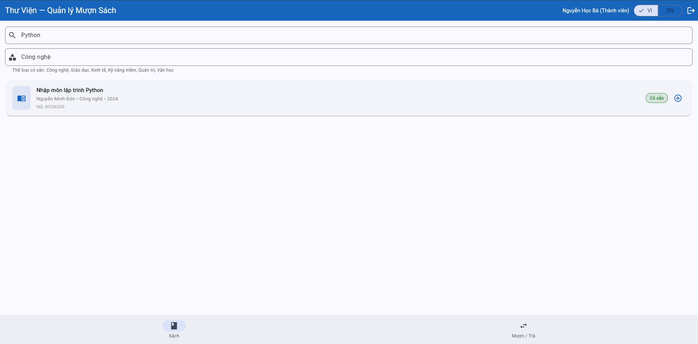

# Bug Reports — Báo cáo lỗi

> **Hướng dẫn**: Tạo 1 mục bug cho mỗi TC có kết quả **Fail**.
> Xem [examples/sample-bug-report.md](../examples/sample-bug-report.md) để hiểu cách viết bug report tốt.
> Mỗi bug cần: tiêu đề mô tả hành vi lỗi, bước tái hiện, expected vs actual, severity + giải thích.

| Thông tin | |
|---|---|
| **Group** | Group 10 |
| **Reporting date** | 04/06/2026 |

---

## BUG-01: The system displays an incorrect error message and uses incorrect validation logic when the user enters an invalid email format on the login screen

| Attribute       | Details             |
| --------------- | ------------------- |
| **Bug ID**      | BUG-01              |
| **Related TC**  | TC-07, TC-08, TC-09 |
| **Related REQ** | REQ-01              |
| **Severity**    | Medium              |
| **Reported By** | Ngo Chan Hiep       |
| **Date Found**  | 28/05/2026          |
| **Status**      | Open                |

### Steps to Reproduce

 Scenario 1 (TC-07)

1. Open the login page.
2. Enter email: `librarianlibrarycom`
3. Enter any password.
4. Click **Login**.

 Scenario 2 (TC-08)

1. Open the login page.
2. Enter email: `librarianlibrary.com`
3. Enter password: `admin123`
4. Click **Login**.

 Scenario 3 (TC-09)

1. Open the login page.
2. Enter email: `librarian@librarycom`
3. Enter password: `admin123`
4. Click **Login**.

### Expected Result

For all invalid email formats:

* The system should validate the email format before sending a request to the server or querying the database.
* The system should display an error message such as:

  * **"Invalid email format"**
  * or **"Email is invalid"**
* The login process should be stopped until a valid email format is entered.

### Actual Result
For all three scenarios, the system displays:

**"Member not found"**

instead of indicating that the email format is invalid.

### Impact

* Users may believe that the account does not exist rather than understanding that the email format is incorrect.
* The error message is misleading and does not help users identify the actual input problem.
* The system performs unnecessary account lookup operations before validating user input.

### Evidence

### Proposed Fix

* Implement client-side and/or server-side email format validation before checking account existence.
* Use a standard email validation regex or a trusted validation library.
* When the email format is invalid:

  * Stop the login process immediately.
  * Display the message **"Invalid email format"** (or the system-standard validation message).
* Perform database lookup only after the email format passes validation.

---

## BUG-02: Email validation logic issue – valid emails are rejected while invalid emails (missing ".") are accepted

| Attribute       | Details                   |
| --------------- | ------------------------- |
| **Bug ID**      | BUG-02                    |
| **Related TC**  | TC-08, TC-11              |
| **Related REQ** | REQ-07                    |
| **Severity**    | High                      |
| **Date Found**  | 29/05/2026                |
| **Status**      | Open                      |

### Environment

* Browser: Chrome
* Operating System: Windows 11
* Interface Language: Vietnamese

### Preconditions

* Logged in with a Librarian account.
* The Add New Member page is open.

### Steps to Reproduce

1. Open the Add New Member page.

2. Case 1 (TC-08):

   * Enter all valid information.
   * Use a valid email: `ngohiep010605@gmail.com`.
   * Click **Add Member**.

3. Case 2 (TC-05):

   * Enter all required information.
   * Use an invalid email that contains "@" but is missing "." in the domain: `ghiep342@gmailcom`.
   * Click **Add Member**.

### Expected Result

1. Case 1: The member is created successfully, data is saved, and a success message is displayed.
2. Case 2: The system should block the request and display the message: **"Invalid email"**.

### Actual Result
1. Case 1: The system blocks the request and displays **"Invalid email"**.
2. Case 2: The system successfully creates a new member with the invalid email `ghiep342@gmailcom`.

### Impact

This violates a core business rule for email validation. Users who enter correct emails cannot register, while invalid emails can be saved into the database, creating invalid records.

### Evidence

### Proposed Fix

* Review and fix the email validation logic in the Add Member feature.
* Ensure the system accepts valid emails that follow common standards (e.g., `username@gmail.com`).
* Ensure the system rejects invalid emails, such as those missing a domain section or missing a "." in the domain (e.g., `ghiep342@gmailcom`).
* Perform regression testing for all email validation scenarios after the fix.
* Use the same email validation rules across both Login and Add Member features to ensure consistent behavior.

---

## BUG-03: Adding a member with an existing email shows the wrong error message ("Invalid email" instead of "Email already exists")

| Attribute       | Details                   |
| --------------- | ------------------------- |
| **Bug ID**      | BUG-03                    |
| **Related TC**  | TC-13 (affected by TC-08) |
| **Related REQ** | REQ-07                    |
| **Severity**    | High                      |
| **Reported By** | Ngo Chan Hiep             |
| **Date Found**  | 29/05/2026                |
| **Status**      | Open                      |

### Environment

* Browser: Chrome
* Operating System: Windows 11
* Interface Language: Vietnamese

### Preconditions

1. Logged in with a Librarian account.
2. An account with the email `dam.tran@email.com` already exists in the system.

### Steps to Reproduce

1. Open the Add New Member page.
2. Enter a valid Full Name and Phone Number.
3. Enter the existing email: `dam.tran@email.com`.
4. Click **Add Member**.

### Expected Result

The system should detect the duplicate email, prevent account creation, and display the message:

**"Email already exists in the system"**

### Actual Result

The system prevents account creation but displays the message:

**"Invalid email"**

### Impact

This violates the business requirement for error messages. The incorrect message may cause users or librarians to think the email format is wrong, while the actual issue is that the email has already been registered.

### Evidence

### Proposed Fix

* Adjust the validation flow as follows:

  1. Check required fields.
  2. Validate email format.
  3. Check whether the email already exists.
  4. Create the account.

* When a duplicate email is detected, display the correct message:
  **"Email already exists in the system"**.

* Separate email format validation errors from duplicate email errors so each issue has its own clear message.

* Add a dedicated test case for a valid but already existing email.

---

## BUG-04: The Add Member feature only displays the "Full Name" error message when the entire form is left blank

| Attribute       | Details       |
| --------------- | ------------- |
| **Bug ID**      | BUG-04        |
| **Related TC**  | TC-10         |
| **Related REQ** | REQ-07        |
| **Severity**    | Low           |
| **Reported By** | Ngo Chan Hiep |
| **Date Found**  | 29/05/2026    |
| **Status**      | Open          |

### Environment

* Browser: Chrome
* Operating System: Windows 11
* Interface Language: Vietnamese

### Preconditions

* Logged in with a Librarian account.
* The Add New Member page is open.
* All input fields are empty.

### Steps to Reproduce

1. Leave all required fields empty:

   * Full Name
   * Email
   * Phone Number

2. Click **Add Member**.

### Expected Result

The system should block the request and display validation messages for all required fields that are empty (Full Name, Email, and Phone Number) so the user can correct them at once.

### Actual Result

The system only displays one validation message:

**"Full Name cannot be empty"**

No validation message is displayed for the Email or Phone Number fields, even though they are also empty.

### Impact

This negatively affects the user experience (UX). Users must repeatedly click the **Add Member** button because new validation errors only appear after fixing the previous one, which wastes time and causes frustration.

### Evidence

### Proposed Fix

* Update the validation mechanism to check all required fields in a single submission.
* Display validation messages for all invalid fields at the same time instead of stopping at the first error.
* Highlight each invalid field visually (e.g., red border or warning icon) to help users identify and fix issues more easily.
* Re-test scenarios where one or more required fields are missing to ensure all validation errors are displayed correctly in a single attempt.

---
## BUG-05: Search keyword is ignored when category is selected before searching

| Attribute           | Details                |
| ------------------- | ---------------------- |
| **Bug ID**          | BUG-05                 |
| **Related TC**      | TC-23, TC-27           |
| **Related REQ**     | REQ-03                 |
| **Severity**        | Medium                 |
| **Reporter**        | Lê Đắc Duy - 23BA14084 |
| **Date Discovered** | 02/06/2026             |
| **Status**          | Open                   |

**Title:**
Search keyword is ignored when the user selects category before entering the search keyword

**Environment:**

* Browser: Chrome
* OS: Windows 11
* Interface Language: Vietnamese

**Prerequisites:**

* The user has logged in successfully.
* The user is currently on the `Books` tab.
* The system has the category `Công nghệ`.
* The book list contains books in the `Công nghệ` category, including `Nhập môn lập trình Python`.

**Reproduction Steps:**

**Case 1: Search first, then select category**

1. Enter the keyword `Python` in the search box.
2. Select the category `Công nghệ`.
3. Observe the displayed book list.

**Case 2: Select category first, then search**

1. Clear the search box and category filter.
2. Select the category `Công nghệ`.
3. Enter the keyword `Python` in the search box.
4. Observe the displayed book list.

**Expected Result:**

In both cases, the system should display the same result list.

The displayed books must satisfy both conditions:

* The book belongs to the `Công nghệ` category.
* The book title or author contains the keyword `Python`.

For example, the system should only display the book `Nhập môn lập trình Python`.

**Actual Result:**

* In Case 1, when the user enters `Python` first and then selects `Công nghệ`, the system displays the correct result: only `Nhập môn lập trình Python`.
* In Case 2, when the user selects `Công nghệ` first and then enters `Python`, the system displays all books in the `Công nghệ` category, including books that do not contain the keyword `Python`.

**Impact:**

The Search & Filter function gives inconsistent results depending on the input order. Users may receive unrelated books when they select a category before entering a search keyword, making the filter feature unreliable.

**Evidence:**

**Proposed Fix:**

* Recalculate the book list whenever either the search keyword or category filter changes.
* Apply both search keyword and category filter together using AND logic.
* Ensure the result is consistent regardless of input order:

  * Search keyword first, then category.
  * Category first, then search keyword.
* Add regression tests for both input orders.

---

## BUG-07: Category filter does not return books when entering a valid category keyword

| Attribute           | Details                |
| ------------------- | ---------------------- |
| **Bug ID**          | BUG-07                 |
| **Related TC**      | TC-23                  |
| **Related REQ**     | REQ-03                 |
| **Severity**        | Medium                 |
| **Reporter**        | Lê Đắc Duy - 23BA14084 |
| **Date Discovered** | 02/06/2026             |
| **Status**          | Open                   |

**Environment:**

* Browser: Chrome
* OS: Windows 11
* Interface Language: Vietnamese

**Prerequisites:**
The user has logged in successfully and is currently on the `Books` tab. The system displays available categories such as `Công nghệ`, `Giáo dục`, `Kinh tế`, `Kỹ năng mềm`, `Quản trị`, and `Văn học`.

**Reproduction Steps:**

1. Access the system website: https://stqa.rbc.vn.
2. Log in with a valid account.
3. Open the `Books` tab.
4. Click the category filter field.
5. Enter a valid category keyword such as `Công`.
6. Observe the displayed book list.
7. Clear the category filter field.
8. Enter another valid category keyword such as `Kinh`, `Văn`, or `Giáo`.
9. Observe the displayed book list again.

**Expected Result:**
The system should display books that belong to the matching category. For example, entering `Công` should display books in the `Công nghệ` category, and entering `Kinh` should display books in the `Kinh tế` category.

**Actual Result:**
The system does not display any books when entering valid category keywords in the category filter field.

**Impact:**
Users cannot filter books by category even though valid categories are available. This makes the category filter function ineffective and does not meet the search/filter requirement.

**Evidence:**

**Proposed Fix:**

* Update the category filter logic to compare user input with available category names.
* Support partial matching for valid category keywords.
* Normalize Vietnamese text and letter case before filtering.
* Ensure books are displayed when the entered keyword matches an existing category.
* Add test cases for valid category keywords such as `Công`, `Kinh`, `Văn`, and `Giáo`.

---

## BUG-08

| Thuộc tính | Chi tiết |
|-----------|---------|
| **Mã lỗi** | BUG-08 |
| **TC liên quan** | TC-26 |
| **REQ liên quan** | REQ-04 |
| **Mức độ** | **High** — Violates core business rules by allowing members to borrow books beyond the maximum limit, leading to system inventory discrepancies|
| **Người phát hiện** | Nguyễn Văn Hoàng - 23BA14122 |
| **Ngày phát hiện** | 05/06/2026 |
| **Trạng thái** | Open |

**Tiêu đề:**
System allows member to borrow 4 books concurrently (Off-by-one boundary error on the limit of 3 books)

**Môi trường:**
- Trình duyệt: Chrome Version 148.0.7778.217
- Hệ điều hành: Windows 11
- Ngôn ngữ giao diện: Tiếng Việt

**Điều kiện tiên quyết:**
- Member account `"ba.nguyen@email.com"` is logged in.
- The account currently has exactly 1 active borrowed book record in the system (according to Seed Data).

**Bước tái hiện:**
1. Navigate to the "Books" tab.
2. Click the `(+)` button to borrow book `BOOK001` (Total active borrows = 2).
3. Click the `(+)` button to borrow book `BOOK002` (Total active borrows = 3).
4. Attempt to borrow a 4th book (`BOOK005`) by clicking its `(+)` button.

**Kết quả mong đợi:**
At step 4, the system must block the action and display a clear error message stating: "Đã đạt giới hạn 3 cuốn sách" (Maximum limit of 3 books reached) to prevent the 4th book from being borrowed.

**Kết quả thực tế:**
At step 4, the system allows the borrow action for `BOOK005` to process successfully. The member's total active borrowed books increases to 4 without any warning or restriction.

**Tác động:**
Allows users to bypass the business rule constraint. If deployed to production, it will break the library inventory workflow, disrupt book availability tracking, and negatively impact other members' borrowing privileges.

**Minh chứng:**

**Đề xuất xử lý:**
Verify the comparison operator inside the active borrows validation logic. Ensure the system restricts the borrow action if `active_borrows >= 3` instead of an incorrect condition like `< 4` or `<= 3`.

---

## BUG-09

| Thuộc tính | Chi tiết |
|-----------|---------|
| **Mã lỗi** | BUG-09 |
| **TC liên quan** | TC-27 |
| **REQ liên quan** | REQ-04 |
| **Mức độ** | **High** — System misidentifies user core account state and displays an incorrect, misleading error message during the core workflow |
| **Người phát hiện** | Nguyễn Văn Hoàng 23BA14122 |
| **Ngày phát hiện** | 05/06/2026 |
| **Trạng thái** | Open |

**Tiêu đề:**
"Suspended" member account displays incorrect error message stating "Thành viên đã hết hạn" upon borrowing

**Môi trường:**
- Trình duyệt: Chrome 148.0.7778.217
- Hệ điều hành: Windows 11
- Ngôn ngữ giao diện: Tiếng Việt

**Điều kiện tiên quyết:**
- Member account `"cu.le@email.com"` is logged in (Account status is Suspended in Seed Data).

**Bước tái hiện:**
1. Navigate to the "Books" tab.
2. Find any book that is currently marked as "Có sẵn" (Available).
3. Click the `(+)` button to attempt to borrow the book.

**Kết quả mong đợi:**
The system blocks the action and displays a specific error message reflecting that the account is currently "Suspended / Temporarily Disabled".

**Kết quả thực tế:**
The system blocks the action but displays an incorrect, unrelated red error banner at the bottom stating: "Thành viên đã hết hạn. Không thể mượn sách." (Member has expired. Cannot borrow book).

**Tác động:**
The system mismaps and misidentifies the user state workflow. It misleads suspended members about the actual reason their features are locked, making it difficult for administrators or librarians to handle user complaints and inquiries accurately.

**Minh chứng:**

**Đề xuất xử lý:**
Check the error handling logic or the conditional flow (`switch/case` or `if/else`) that validates member status during the borrow process. Ensure that the error code returned for a `Suspended` account maps to its correct UI string instead of falling back to the `Expired` account message string.
---

## BUG-10

| **Attribute**   | Details                |
| --------------- | ---------------------- |
| **BUG ID**      | `BUG-10`               |
| **Related ID**  | `TC-35`                |
| **Related Req** | `REQ-05`               |
| **Severity**    | `High`                 |
| **Reporter**    | `Nguyễn Văn Hoàng` |
| **Date Found**  | `07/06/2026`           |
| **Status**      | `Open`                 |

**Title:**
`Do not display overdue book return warnings when returns are overdue`

**Enviroment:**

- Browser: Chrome `Version 149.0.7827.54`
- OS: `Window 11`
- UI Language: `English & Vietnammese`

**Prerequisites:**
`Account successfully logged in, at least one book is overdue for return in the borrowing list`

**Steps to Reproduce:**

1. `Step 1: Log in to your account successfully`
2. `Step 2: Go to the "Borrowed Books" section`
3. `Step 3: Confirm that there are books that are overdue. Click "Return Book" on that overdue book`
4. `Step 4: Confirm returning the book`

**Expected Result:**
`After returning, the system must display a warning notification like "Book is overdue by X days, you may be fined" so users are aware`

**Actual Result:**
`The book return process is normal; no warnings or penalty notices are displayed`

**Impact:**
`Users are unaware of being fined, leading to surprise and complaints. Librarians have no basis to notify them of the fine because the system doesn't record it. This affects the transparency of the library system`

**Evidence:**

**Proposed Solution:**
`Add a warning popup before confirming overdue book returns, displaying the number of days late and the corresponding penalty fee. The backend should also calculate and return the penalty fee information along with the response for overdue book returns, and save the penalty history to the database for librarians to review`
