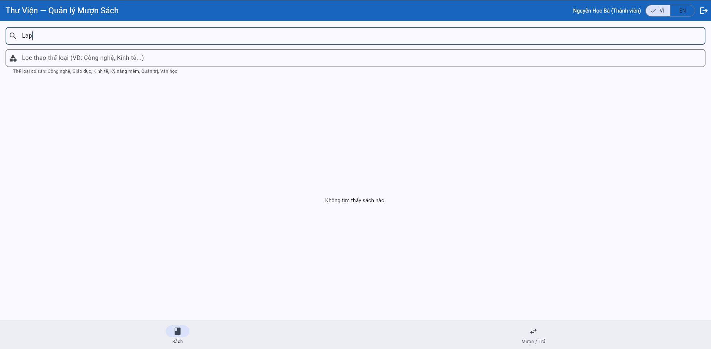

## BUG-01

| Attribute           | Details                |
| ------------------- | ---------------------- |
| **Bug ID**          | BUG-01                 |
| **Related TC**      | TC-08                  |
| **Related REQ**     | REQ-03                 |
| **Severity**        | Medium                 |
| **Reporter**        | Lê Đắc Duy - 23BA14084 |
| **Date Discovered** | 02/06/2026             |
| **Status**          | Open                   |

**Title:**
Search function does not support Vietnamese keywords without accents

**Environment:**

* Browser: Chrome
* OS: Windows 11
* Interface Language: Vietnamese

**Prerequisites:**
The user has logged in successfully and is currently on the `Books` tab. The book list contains Vietnamese book titles with accents, such as `Lập trình Flutter cơ bản` or `Kiểm thử phần mềm nhập môn`.

**Reproduction Steps:**

1. Access the system website: https://stqa.rbc.vn.
2. Log in with a valid account.
3. Open the `Books` tab.
4. Enter a Vietnamese keyword without accents, such as `lap trinh`, in the search box.
5. Observe the displayed result.
6. Clear the search box.
7. Enter another keyword without accents, such as `kiem thu` or `nhap mon`.
8. Observe the displayed result again.

**Expected Result:**
The system should return matching books even when the user enters Vietnamese keywords without accents. For example, searching `lap trinh` should still find books containing `Lập trình`.

**Actual Result:**
The system does not display any matching books when the Vietnamese keyword is entered without accents.

**Impact:**
This reduces search usability for Vietnamese users. Many users may type Vietnamese keywords without accents, but the system cannot find existing books even though the books are available in the list.

**Evidence:**

**How to take evidence:**

1. Open the `Books` tab.
2. Take a screenshot showing that a book with Vietnamese accented title exists, for example `Lập trình Flutter cơ bản`.
3. Enter `lap trinh` in the search box.
4. Take another screenshot showing that no matching book is displayed.
5. Save the screenshots as:

   * `images/BUG-01-1.png`
   * `images/BUG-01-2.png`

**Proposed Fix:**

* Normalize Vietnamese text before searching.
* Remove accents from both the search keyword and book title/author before comparison.
* Support accent-insensitive search so that `lap trinh` can match `Lập trình`.
* Add test cases for searching Vietnamese book titles with and without accents.

---

## BUG-02

| Attribute           | Details                |
| ------------------- | ---------------------- |
| **Bug ID**          | BUG-02                 |
| **Related TC**      | TC-13, TC-14           |
| **Related REQ**     | REQ-03                 |
| **Severity**        | Medium                 |
| **Reporter**        | Lê Đắc Duy - 23BA14084 |
| **Date Discovered** | 02/06/2026             |
| **Status**          | Open                   |

**Title:**
Category filter does not return books when entering a valid category keyword

**Environment:**

* Browser: Chrome
* OS: Windows 11
* Interface Language: Vietnamese

**Prerequisites:**
The user has logged in successfully and is currently on the `Books` tab. The system displays available categories such as `Công nghệ`, `Giáo dục`, `Kinh tế`, `Kỹ năng mềm`, `Quản trị`, and `Văn học`.

**Reproduction Steps:**

1. Access the system website: https://stqa.rbc.vn.
2. Log in with a valid account.
3. Open the `Books` tab.
4. Click the category filter field.
5. Enter a valid category keyword such as `Công`.
6. Observe the displayed book list.
7. Clear the category filter field.
8. Enter another valid category keyword such as `Kinh`, `Văn`, or `Giáo`.
9. Observe the displayed book list again.

**Expected Result:**
The system should display books that belong to the matching category. For example, entering `Công` should display books in the `Công nghệ` category, and entering `Kinh` should display books in the `Kinh tế` category.

**Actual Result:**
The system does not display any books when entering valid category keywords in the category filter field.

**Impact:**
Users cannot filter books by category even though valid categories are available. This makes the category filter function ineffective and does not meet the search/filter requirement.

**Evidence:**

**How to take evidence:**

1. Open the `Books` tab.
2. Take a screenshot showing the category filter field and the available category suggestion text, for example: `Công nghệ, Giáo dục, Kinh tế, Kỹ năng mềm, Quản trị, Văn học`.
3. Enter `Công` in the category filter field.
4. Take a screenshot showing that no books are displayed.
5. Clear the field and enter `Kinh`.
6. Take another screenshot showing that no books are displayed.
7. Save the screenshots as:

   * `images/BUG-02-1.png`
   * `images/BUG-02-2.png`
   * `images/BUG-02-3.png`

**Proposed Fix:**

* Update the category filter logic to compare user input with available category names.
* Support partial matching for valid category keywords.
* Normalize Vietnamese text and letter case before filtering.
* Ensure books are displayed when the entered keyword matches an existing category.
* Add test cases for valid category keywords such as `Công`, `Kinh`, `Văn`, and `Giáo`.

---
