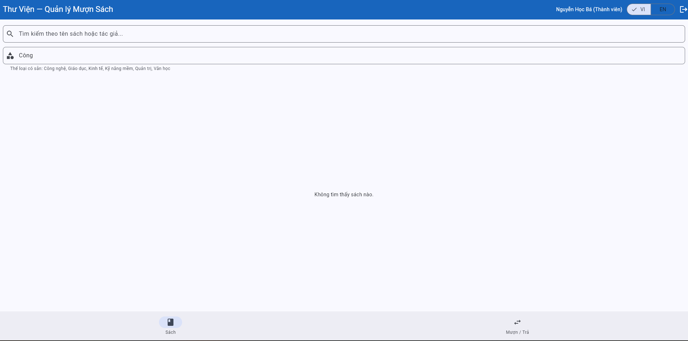

# Bug Reports — Báo cáo lỗi

> **Hướng dẫn**: Tạo 1 mục bug cho mỗi TC có kết quả **Fail**.
> Xem [examples/sample-bug-report.md](../examples/sample-bug-report.md) để hiểu cách viết bug report tốt.
> Mỗi bug cần: tiêu đề mô tả hành vi lỗi, bước tái hiện, expected vs actual, severity + giải thích.

| Thông tin | |
|---|---|
| **Group** | Group 10 |
| **Reporting date** | 04/06/2026 |

---

## BUG-01: The system displays an incorrect error message and uses incorrect validation logic when the user enters an invalid email format on the login screen

| Attribute       | Details             |
| --------------- | ------------------- |
| **Bug ID**      | BUG-01              |
| **Related TC**  | TC-07, TC-08, TC-09 |
| **Related REQ** | REQ-01              |
| **Severity**    | Medium              |
| **Reported By** | Ngo Chan Hiep       |
| **Date Found**  | 28/05/2026          |
| **Status**      | Open                |

### Steps to Reproduce

1. Open the system login page.
2. Enter an invalid email format (e.g., `ngochanhiepdepzai`), enter any valid password, and click the Login button.

### Expected Result

* The system should validate the email format before checking the database.
* Display the message: **"Invalid email format"**.

### Actual Result

The system displays the message: **"Member not found"**.

### Impact

This may confuse users. They may think the email has not been registered in the system or believe that they did not enter an email, even though they entered one with an incorrect format.

### Evidence

### Proposed Fix

* Add email format validation before searching for the account in the database.
* Use a standard email validation regex or a suitable validation library.
* When the email format is invalid, stop the login process and display the message: **"Invalid email format"**.
* Only check whether the account exists after the email format has been validated.

---

## BUG-02: Email validation logic issue – valid emails are rejected while invalid emails (missing ".") are accepted

| Attribute       | Details                   |
| --------------- | ------------------------- |
| **Bug ID**      | BUG-02                    |
| **Related TC**  | TC-08, TC-11              |
| **Related REQ** | REQ-07                    |
| **Severity**    | High                      |
| **Reported By** | Ngo Chan Hiep - 23BA14102 |
| **Date Found**  | 29/05/2026                |
| **Status**      | Open                      |

### Environment

* Browser: Chrome
* Operating System: Windows 11
* Interface Language: Vietnamese

### Preconditions

* Logged in with a Librarian account.
* The Add New Member page is open.

### Steps to Reproduce

1. Open the Add New Member page.

2. Case 1 (TC-08):

   * Enter all valid information.
   * Use a valid email: `ngohiep010605@gmail.com`.
   * Click **Add Member**.

3. Case 2 (TC-05):

   * Enter all required information.
   * Use an invalid email that contains "@" but is missing "." in the domain: `ghiep342@gmailcom`.
   * Click **Add Member**.

### Expected Result

1. Case 1: The member is created successfully, data is saved, and a success message is displayed.
2. Case 2: The system should block the request and display the message: **"Invalid email"**.

### Actual Result

1. Case 1: The system blocks the request and displays **"Invalid email"**.
2. Case 2: The system successfully creates a new member with the invalid email `ghiep342@gmailcom`.

### Impact

This violates a core business rule for email validation. Users who enter correct emails cannot register, while invalid emails can be saved into the database, creating invalid records.

### Evidence

### Proposed Fix

* Review and fix the email validation logic in the Add Member feature.
* Ensure the system accepts valid emails that follow common standards (e.g., `username@gmail.com`).
* Ensure the system rejects invalid emails, such as those missing a domain section or missing a "." in the domain (e.g., `ghiep342@gmailcom`).
* Perform regression testing for all email validation scenarios after the fix.
* Use the same email validation rules across both Login and Add Member features to ensure consistent behavior.

---

## BUG-03: Adding a member with an existing email shows the wrong error message ("Invalid email" instead of "Email already exists")

| Attribute       | Details                   |
| --------------- | ------------------------- |
| **Bug ID**      | BUG-03                    |
| **Related TC**  | TC-13 (affected by TC-08) |
| **Related REQ** | REQ-07                    |
| **Severity**    | High                      |
| **Reported By** | Ngo Chan Hiep             |
| **Date Found**  | 29/05/2026                |
| **Status**      | Open                      |

### Environment

* Browser: Chrome
* Operating System: Windows 11
* Interface Language: Vietnamese

### Preconditions

1. Logged in with a Librarian account.
2. An account with the email `dam.tran@email.com` already exists in the system.

### Steps to Reproduce

1. Open the Add New Member page.
2. Enter a valid Full Name and Phone Number.
3. Enter the existing email: `dam.tran@email.com`.
4. Click **Add Member**.

### Expected Result

The system should detect the duplicate email, prevent account creation, and display the message:

**"Email already exists in the system"**

### Actual Result

The system prevents account creation but displays the message:

**"Invalid email"**

### Impact

This violates the business requirement for error messages. The incorrect message may cause users or librarians to think the email format is wrong, while the actual issue is that the email has already been registered.

### Evidence

### Proposed Fix

* Adjust the validation flow as follows:

  1. Check required fields.
  2. Validate email format.
  3. Check whether the email already exists.
  4. Create the account.

* When a duplicate email is detected, display the correct message:
  **"Email already exists in the system"**.

* Separate email format validation errors from duplicate email errors so each issue has its own clear message.

* Add a dedicated test case for a valid but already existing email.

---

## BUG-04: The Add Member feature only displays the "Full Name" error message when the entire form is left blank

| Attribute       | Details       |
| --------------- | ------------- |
| **Bug ID**      | BUG-04        |
| **Related TC**  | TC-10         |
| **Related REQ** | REQ-07        |
| **Severity**    | Low           |
| **Reported By** | Ngo Chan Hiep |
| **Date Found**  | 29/05/2026    |
| **Status**      | Open          |

### Environment

* Browser: Chrome
* Operating System: Windows 11
* Interface Language: Vietnamese

### Preconditions

* Logged in with a Librarian account.
* The Add New Member page is open.
* All input fields are empty.

### Steps to Reproduce

1. Leave all required fields empty:

   * Full Name
   * Email
   * Phone Number

2. Click **Add Member**.

### Expected Result

The system should block the request and display validation messages for all required fields that are empty (Full Name, Email, and Phone Number) so the user can correct them at once.

### Actual Result

The system only displays one validation message:

**"Full Name cannot be empty"**

No validation message is displayed for the Email or Phone Number fields, even though they are also empty.

### Impact

This negatively affects the user experience (UX). Users must repeatedly click the **Add Member** button because new validation errors only appear after fixing the previous one, which wastes time and causes frustration.

### Evidence

### Proposed Fix

* Update the validation mechanism to check all required fields in a single submission.
* Display validation messages for all invalid fields at the same time instead of stopping at the first error.
* Highlight each invalid field visually (e.g., red border or warning icon) to help users identify and fix issues more easily.
* Re-test scenarios where one or more required fields are missing to ensure all validation errors are displayed correctly in a single attempt.

---
## BUG-06

| Attribute           | Details                |
| ------------------- | ---------------------- |
| **Bug ID**          | BUG-06                 |
| **Related TC**      | TC-08                  |
| **Related REQ**     | REQ-03                 |
| **Severity**        | Medium                 |
| **Reporter**        | Lê Đắc Duy - 23BA14084 |
| **Date Discovered** | 02/06/2026             |
| **Status**          | Open                   |

**Title:**
Search function does not support Vietnamese keywords without accents

**Environment:**

* Browser: Chrome
* OS: Windows 11
* Interface Language: Vietnamese

**Prerequisites:**
The user has logged in successfully and is currently on the `Books` tab. The book list contains Vietnamese book titles with accents, such as `Lập trình Flutter cơ bản` or `Kiểm thử phần mềm nhập môn`.

**Reproduction Steps:**

1. Access the system website: https://stqa.rbc.vn.
2. Log in with a valid account.
3. Open the `Books` tab.
4. Enter a Vietnamese keyword without accents, such as `lap trinh`, in the search box.
5. Observe the displayed result.
6. Clear the search box.
7. Enter another keyword without accents, such as `kiem thu` or `nhap mon`.
8. Observe the displayed result again.

**Expected Result:**
The system should return matching books even when the user enters Vietnamese keywords without accents. For example, searching `lap trinh` should still find books containing `Lập trình`.

**Actual Result:**
The system does not display any matching books when the Vietnamese keyword is entered without accents.

**Impact:**
This reduces search usability for Vietnamese users. Many users may type Vietnamese keywords without accents, but the system cannot find existing books even though the books are available in the list.

**Evidence:**

**Proposed Fix:**

* Normalize Vietnamese text before searching.
* Remove accents from both the search keyword and book title/author before comparison.
* Support accent-insensitive search so that `lap trinh` can match `Lập trình`.
* Add test cases for searching Vietnamese book titles with and without accents.

---

## BUG-07

| Attribute           | Details                |
| ------------------- | ---------------------- |
| **Bug ID**          | BUG-07                 |
| **Related TC**      | TC-13, TC-14           |
| **Related REQ**     | REQ-03                 |
| **Severity**        | Medium                 |
| **Reporter**        | Lê Đắc Duy - 23BA14084 |
| **Date Discovered** | 02/06/2026             |
| **Status**          | Open                   |

**Title:**
Category filter does not return books when entering a valid category keyword

**Environment:**

* Browser: Chrome
* OS: Windows 11
* Interface Language: Vietnamese

**Prerequisites:**
The user has logged in successfully and is currently on the `Books` tab. The system displays available categories such as `Công nghệ`, `Giáo dục`, `Kinh tế`, `Kỹ năng mềm`, `Quản trị`, and `Văn học`.

**Reproduction Steps:**

1. Access the system website: https://stqa.rbc.vn.
2. Log in with a valid account.
3. Open the `Books` tab.
4. Click the category filter field.
5. Enter a valid category keyword such as `Công`.
6. Observe the displayed book list.
7. Clear the category filter field.
8. Enter another valid category keyword such as `Kinh`, `Văn`, or `Giáo`.
9. Observe the displayed book list again.

**Expected Result:**
The system should display books that belong to the matching category. For example, entering `Công` should display books in the `Công nghệ` category, and entering `Kinh` should display books in the `Kinh tế` category.

**Actual Result:**
The system does not display any books when entering valid category keywords in the category filter field.

**Impact:**
Users cannot filter books by category even though valid categories are available. This makes the category filter function ineffective and does not meet the search/filter requirement.

**Evidence:**

**Proposed Fix:**

* Update the category filter logic to compare user input with available category names.
* Support partial matching for valid category keywords.
* Normalize Vietnamese text and letter case before filtering.
* Ensure books are displayed when the entered keyword matches an existing category.
* Add test cases for valid category keywords such as `Công`, `Kinh`, `Văn`, and `Giáo`.

---

## BUG-08

| Thuộc tính | Chi tiết |
|-----------|---------|
| **Mã lỗi** | BUG-08 |
| **TC liên quan** | TC-02 |
| **REQ liên quan** | REQ-04 |
| **Mức độ** | **High** — Violates core business rules by allowing members to borrow books beyond the maximum limit, leading to system inventory discrepancies|
| **Người phát hiện** | Nguyễn Văn Hoàng 23BA14122 |
| **Ngày phát hiện** | 05/06/2026 |
| **Trạng thái** | Open |

**Tiêu đề:**
System allows member to borrow 4 books concurrently (Off-by-one boundary error on the limit of 3 books)

**Môi trường:**
- Trình duyệt: Chrome Version 148.0.7778.217
- Hệ điều hành: Windows 11
- Ngôn ngữ giao diện: Tiếng Việt

**Điều kiện tiên quyết:**
- Member account `"ba.nguyen@email.com"` is logged in.
- The account currently has exactly 1 active borrowed book record in the system (according to Seed Data).

**Bước tái hiện:**
1. Navigate to the "Books" tab.
2. Click the `(+)` button to borrow book `BOOK002` (Total active borrows = 2).
3. Click the `(+)` button to borrow book `BOOK004` (Total active borrows = 3).
4. Attempt to borrow a 4th book (`BOOK005`) by clicking its `(+)` button.

**Kết quả mong đợi:**
At step 4, the system must block the action and display a clear error message stating: "Đã đạt giới hạn 3 cuốn sách" (Maximum limit of 3 books reached) to prevent the 4th book from being borrowed.

**Kết quả thực tế:**
At step 4, the system allows the borrow action for `BOOK005` to process successfully. The member's total active borrowed books increases to 4 without any warning or restriction.

**Tác động:**
Allows users to bypass the business rule constraint. If deployed to production, it will break the library inventory workflow, disrupt book availability tracking, and negatively impact other members' borrowing privileges.

**Minh chứng:**

**Đề xuất xử lý:**
Verify the comparison operator inside the active borrows validation logic. Ensure the system restricts the borrow action if `active_borrows >= 3` instead of an incorrect condition like `< 4` or `<= 3`.

---

## BUG-09

| Thuộc tính | Chi tiết |
|-----------|---------|
| **Mã lỗi** | BUG-09 |
| **TC liên quan** | TC-03 |
| **REQ liên quan** | REQ-04 |
| **Mức độ** | **High** — System misidentifies user core account state and displays an incorrect, misleading error message during the core workflow |
| **Người phát hiện** | Nguyễn Văn Hoàng 23BA14122 |
| **Ngày phát hiện** | 05/06/2026 |
| **Trạng thái** | Open |

**Tiêu đề:**
"Suspended" member account displays incorrect error message stating "Thành viên đã hết hạn" upon borrowing

**Môi trường:**
- Trình duyệt: Chrome 148.0.7778.217
- Hệ điều hành: Windows 11
- Ngôn ngữ giao diện: Tiếng Việt

**Điều kiện tiên quyết:**
- Member account `"cu.le@email.com"` is logged in (Account status is Suspended in Seed Data).

**Bước tái hiện:**
1. Navigate to the "Books" tab.
2. Find any book that is currently marked as "Có sẵn" (Available).
3. Click the `(+)` button to attempt to borrow the book.

**Kết quả mong đợi:**
The system blocks the action and displays a specific error message reflecting that the account is currently "Suspended / Temporarily Disabled".

**Kết quả thực tế:**
The system blocks the action but displays an incorrect, unrelated red error banner at the bottom stating: "Thành viên đã hết hạn. Không thể mượn sách." (Member has expired. Cannot borrow book).

**Tác động:**
The system mismaps and misidentifies the user state workflow. It misleads suspended members about the actual reason their features are locked, making it difficult for administrators or librarians to handle user complaints and inquiries accurately.

**Minh chứng:**

**Đề xuất xử lý:**
Check the error handling logic or the conditional flow (`switch/case` or `if/else`) that validates member status during the borrow process. Ensure that the error code returned for a `Suspended` account maps to its correct UI string instead of falling back to the `Expired` account message string.
---
