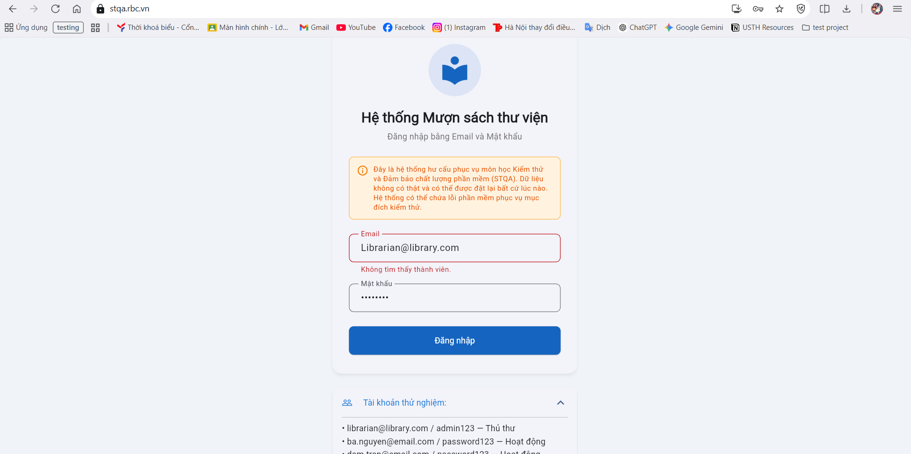
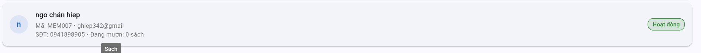
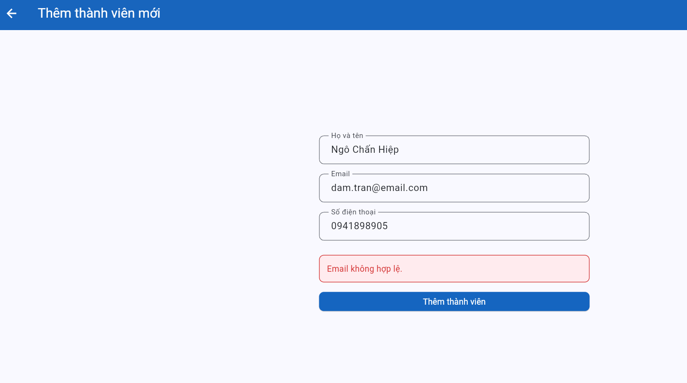
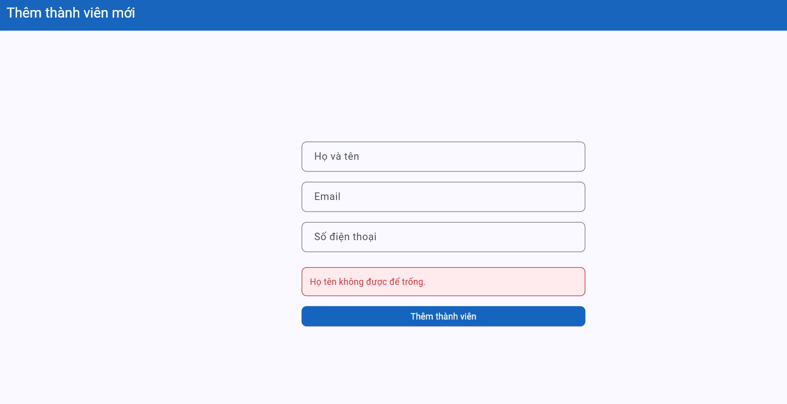

# Bug Reports

> **Instructions**: Create 1 bug item for each TC with a **Fail** result.
> See [examples/sample-bug-report.md](../examples/sample-bug-report.md) to understand how to write a good bug report.
> Each bug needs: descriptive title of the bug behavior, reproduction steps, expected vs actual, severity + explanation.

| Information | |
|---|---|
| **Team** | Team 10 |
| **Report Date** | 30/05/2026 |

---

## BUG-01

| Attribute | Details |
|-----------|---------|
| **Bug ID** | BUG-01 |
| **Related TC** | TC-05 |
| **Related REQ** | REQ-01 |
| **Severity** | High |
| **Reporter** | Ngô Chấn Hiệp - 23BA14102 |
| **Date Discovered** | 27/05/2026 |
| **Status** | Open |

**Title:**
Login function is case-sensitive for email, leading to incorrect error message: "Member not found"

**Environment:**
- Browser: Chrome 
- OS: Windows 11
- Interface Language: Vietnamese

**Prerequisites:**
Login page is open, system has an existing valid member account with a lowercase email (e.g., librarian@library.com)

**Reproduction Steps:**
1. Access the system login page.
2. In the email field, enter the valid email but capitalize the first letter (e.g., Librarian@library.com).
3. In the password field, enter the correct password for that email.
4. Click Login.

**Expected Result:**
The system should not be case-sensitive for email fields; it should automatically convert the email string to lowercase, successfully log in, and redirect to the homepage.

**Actual Result:**
The system enforces case-sensitivity, fails to recognize the account, and displays an inaccurate error message: "Member not found".

**Impact:**
Violates core user experience (UX) guidelines. Mobile users (whose keyboards often auto-capitalize the first letter) or users who accidentally turn on CapsLock will fail to log in despite having a registered account, causing frustration and giving the impression that the system has data errors.

**Evidence:**

**Proposed Fix:**

---

## BUG-02

| Attribute | Details |
|-----------|---------|
| **Bug ID** | BUG-02 |
| **Related TC** | TC-07 |
| **Related REQ** | REQ-01 |
| **Severity** | Medium |
| **Reporter** | Ngô Chấn Hiệp |
| **Date Discovered** | 28/05/2026 |
| **Status** | Open |

**Title:**
System displays incorrect error message and flawed validation logic when entering an invalid email format on the login screen

**Reproduction Steps:**
1. Access the system login screen.
2. Enter an invalid email format (e.g., ngochanhiepdepzai), enter any valid password format, and click the login button.

**Expected Result:**
- The system should perform email format validation before querying the database.
- Display error message: "Invalid email format".

**Actual Result:**
The system displays the error message: "Member not found".

**Impact:**
Causes confusion and misunderstanding for the user. Users will think their email has not been registered yet or think they missed entering the email, even though they did enter it but with an invalid format.

**Evidence:**

**Proposed Fix:**

---

## BUG-03

| Attribute | Details |
|-----------|---------|
| **Bug ID** | BUG-03 |
| **Related TC** | TC-08, TC-11 |
| **Related REQ** | REQ-07 |
| **Severity** | High |
| **Reporter** | Ngô Chấn Hiệp - 23BA14102 |
| **Date Discovered** | 29/05/2026 |
| **Status** | Open |

**Title:**
Email validation logic error: Valid email is blocked with an error, while invalid email (missing dot .) is accepted

**Environment:**
- Browser: Chrome 
- OS: Windows 11
- Interface Language: Vietnamese

**Prerequisites:**
Logged-in account has Librarian permissions. The "Add New Member" page is open.

**Reproduction Steps:**
1. Navigate to the "Add New Member" interface.
2. Case 1 (Replicating TC-08): Fill in all valid details with a properly formatted email `ngohiep010605@gmail.com`, then click the "Add Member" button.
3. Case 2 (Replicating TC-11): Fill in all details with an invalid email format (has @ but missing dot . in domain) `ghiep342@gmailcom`, then click the "Add Member" button.

**Expected Result:**
1. Case 1: Member is successfully created, data is saved, and a success message is displayed.
2. Case 2: System blocks the creation, prevents data submission, and displays an error message: "Invalid email".

**Actual Result:**
1. Case 1: System blocks the action, refuses to create the member, and throws an error: "Invalid email".
2. Case 2: System successfully creates the new member with the malformed email `ghiep342@gmailcom`.

**Impact:**
Violates core business rules on email validation. Prevents valid users from signing up while allowing invalid/junk data to populate the database.

**Evidence:**

**Proposed Fix:**

---

## BUG-04

| Attribute | Details |
|-----------|---------|
| **Bug ID** | BUG-04 |
| **Related TC** | TC-13 (affected by TC-08) |
| **Related REQ** | REQ-07 |
| **Severity** | High |
| **Reporter** | Ngô Chấn Hiệp |
| **Date Discovered** | 29/05/2026 |
| **Status** | Open |

**Title:**
Adding a member with an existing email triggers the wrong error message (Displays "Invalid email" instead of "Email already exists")

**Environment:**
- Browser: Chrome 
- OS: Windows 11 
- Interface Language: Vietnamese

**Prerequisites:**
1. Logged-in account has Librarian permissions.
2. An account with the email `dam.tran@email.com` (properly formatted) already exists in the system.

**Reproduction Steps:**
1. Navigate to the "Add New Member" interface.
2. Enter a valid Full Name and Phone Number.
3. In the email field, enter the pre-existing email: `dam.tran@email.com`.
4. Click the "Add Member" button.

**Expected Result:**
The system checks for duplication, blocks duplicate creation, and displays a clear error message: "Email already exists in the system".

**Actual Result:**
The system blocks the account creation but displays the wrong error message: "Invalid email".

**Impact:**
Violates the SRS business rule error message standard. Misleading notification makes the user/librarian think their email format is wrong, rather than knowing that this email has already been registered.

**Evidence:**

**Proposed Fix:**

---

## BUG-05

| Attribute | Details |
|-----------|---------|
| **Bug ID** | BUG-05 |
| **Related TC** | TC-10 |
| **Related REQ** | REQ-07 |
| **Severity** | Low |
| **Reporter** | Ngô Chấn Hiệp |
| **Date Discovered** | 29/05/2026 |
| **Status** | Open |

**Title:**
"Add Member" function only displays the error message for "Full Name" when the entire form data is left blank.

**Environment:**
- Browser: Chrome 
- OS: Windows 11
- Interface Language: Vietnamese

**Prerequisites:**
Logged-in account has Librarian permissions. The "Add New Member" page is open and all input fields are empty.

**Reproduction Steps:**
1. Leave all fields (Full Name, Email, Phone Number) blank.
2. Click "Add Member".

**Expected Result:**
The system blocks the submission and displays error messages/red validation alerts for all mandatory fields left empty (Full Name, Email, Phone Number) simultaneously, allowing the user to fill them out at once.

**Actual Result:**
The system only displays a single error message: "Full Name cannot be left blank". The Email and Phone Number fields show no validation warnings despite being blank.

**Impact:**
Degrades user experience (UX). Users are forced to click the "Add Member" button multiple times (fixing one field error only to trigger the next sequential error), causing unnecessary delay and irritation.

**Evidence:**

**Proposed Fix:**
