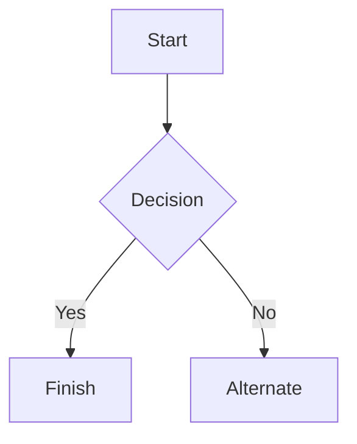

# Markdown syntax guide

## Headers

# This is a Heading h1
## This is a Heading h2
###### This is a Heading h6

## Emphasis

*This text will be italic*  
_This will also be italic_# Test Cases — Bảng trường hợp kiểm thử

> **Hướng dẫn**: Viết tối thiểu **20 TC** phủ đủ các chức năng chính (REQ-01 → REQ-08).
> Xem [examples/sample-test-case.md](../examples/sample-test-case.md) để hiểu cách viết TC tốt.
> Tự tổ chức và phân nhóm test case theo cách hợp lý nhất.

| Thông tin | |
|---|---|
| **Nhóm** | `<!-- Tên nhóm -->` |
| **Ngày tạo** | `<!-- DD/MM/YYYY -->` |
| **Hệ thống** | https://stqa.rbc.vn |
| **Tham chiếu** | SRS v1.0 |

---

## Bước 1: Mô hình hóa miền đầu vào — Input Domain Modeling (IDM)

> 📖 **Textbook:** Chương 6 — *Input Domain Modeling*, Paul Ammann & Jeff Offutt.
>
> **Trước khi viết Test Case**, nhóm **phải** phân tích miền đầu vào bằng bảng IDM bên dưới.
> Mỗi chức năng cần xác định: **Đặc tính (Characteristic)**, **Phân vùng (Block/Partition)**, và **Giá trị đại diện (Value)**.

# Test Cases — Bảng trường hợp kiểm thử

| Thông tin | |
|---|---|
| **Nhóm** | Nhóm 10 |
| **Ngày tạo** | 26/05/2026 |
| **Hệ thống** | https://stqa.rbc.vn |
| **Tham chiếu** | SRS v1.0 |


### IDM - REQ-01: Đăng nhập (Login)

| Đặc tính | Phân vùng | Giá trị đại diện | Kết quả mong đợi |
|---|---|---|---|
| Email tồn tại trong DB? | Có | `librarian@library.com` | Đăng nhập thành công |
| | Không | `noone@email.com` | Báo lỗi "Tài khoản không tồn tại" |
| Mật khẩu đúng? | Đúng | `admin123` | Đăng nhập thành công |
| | Sai | `wrongpass` | Báo lỗi "Mật khẩu không đúng" |
| Ô nhập có rỗng? | Không rỗng | (bất kỳ) | Xử lý bình thường |
| | Rỗng | `""` | Báo lỗi "Vui lòng nhập email và mật khẩu" |

---

### IDM - REQ-02: Xem danh sách sách (View Book List)

| Đặc tính | Phân vùng | Giá trị đại diện | Kết quả mong đợi |
|---|---|---|---|
| Vai trò tài khoản? | Thủ thư | `librarian@library.com` | Xem toàn bộ sách với đầy đủ chi tiết |
| | Thành viên | `ba.nguyen@email.com` | Xem toàn bộ sách với đầy đủ chi tiết |
| Trạng thái sách? | Có sẵn | BOOK001, BOOK002 | Hiển thị "Có sẵn" |
| | Đã mượn | BOOK003 | Hiển thị "Đã mượn" |
| | Thất lạc | BOOK007 | Hiển thị "Thất lạc" |
| Thông tin đầy đủ? | Đủ 5 trường | BOOK001 | Hiện Tên, Tác giả, Thể loại, Năm, Trạng thái |
| Cập nhật realtime? | Sau khi mượn | Mượn BOOK001 | Trạng thái lập tức đổi thành "Đã mượn" |
| | Sau khi trả | Trả BOOK003 | Trạng thái lập tức đổi thành "Có sẵn" |

---

### IDM - REQ-03: Tìm kiếm và lọc sách (Search & Filter)

| Đặc tính | Phân vùng | Giá trị đại diện | Kết quả mong đợi |
|---|---|---|---|
| Từ khóa tồn tại? | Có (Tên sách) | `"Flutter"` | Hiện các sách chứa chữ "Flutter" |
| | Có (Tác giả) | `"Nguyễn"` | Hiện sách của tác giả "Nguyễn" |
| | Không | `"XYZ123"` | Báo "Không tìm thấy sách" |
| Phân biệt hoa/thường? | Chữ thường | `"flutter"` | Kết quả khớp với "Flutter" |
| | Chữ hoa | `"FLUTTER"` | Kết quả khớp với "Flutter" |
| Lọc theo thể loại? | Thể loại có sách | Chọn `"Công nghệ"` | Chỉ hiện sách Công nghệ |
| | Thể loại không sách| Bỏ trống/Không có | Báo "Không tìm thấy sách" |

---

### IDM - REQ-04: Mượn sách (Borrow Book)

| Đặc tính | Phân vùng | Giá trị đại diện | Kết quả mong đợi |
|---|---|---|---|
| Trạng thái sách? | Có sẵn | BOOK001 | Cho phép mượn |
| | Đã mượn | BOOK003 | Từ chối, báo lỗi |
| | Thất lạc | BOOK007 | Từ chối, báo lỗi |
| Trạng thái thành viên? | Hoạt động | MEM002 | Cho phép mượn |
| | Tạm ngưng | MEM004 | Từ chối, báo lỗi tài khoản tạm ngưng |
| | Hết hạn | MEM005 | Từ chối, báo lỗi tài khoản hết hạn |
| Số sách đang mượn? | < 3 | MEM006 (1 cuốn) | Cho phép mượn |
| | = 3 | MEM mượn đủ 3 cuốn| Từ chối, báo lỗi vượt giới hạn |

---

### IDM - REQ-05: Trả sách (Return Book)

| Đặc tính | Phân vùng | Giá trị đại diện | Kết quả mong đợi |
|---|---|---|---|
| Phiếu thuộc về user? | Phải | MEM002 trả BOOK003 | Cho phép trả |
| | Không | MEM002 trả BOOK013 | Ẩn tùy chọn trả / Từ chối |
| Tình trạng thời gian? | Trong hạn | BR003 | Trả thành công, không cảnh báo |
| | Quá hạn | BR001 | Trả thành công **và** hiện cảnh báo quá hạn |
| | Đã trả | BR002 | Ẩn tùy chọn trả |
| Trạng thái sách sau trả?| Thành công | BOOK003 | Đổi thành "Có sẵn" |
| Trạng thái phiếu sau trả?| Thành công | BR001 | Đổi thành "Đã trả" |

---

### IDM - REQ-06: Xử lý sách quá hạn (Overdue Handling)

| Đặc tính | Phân vùng | Giá trị đại diện | Kết quả mong đợi |
|---|---|---|---|
| Người kích hoạt? | Thủ thư | `librarian@library.com` | Quét và cập nhật phiếu quá hạn |
| | Thành viên | Mọi thành viên | Ẩn nút chức năng này |
| Ngày hiện tại vs Hạn? | Trước hạn | Hôm nay < Hạn trả | Giữ nguyên trạng thái "Đang mượn" |
| | Đúng hạn | Hôm nay = Hạn trả | Đánh dấu "Quá hạn" |
| | Sau hạn | Hôm nay > Hạn trả | Đánh dấu "Quá hạn" |
| Thành viên xem quá hạn? | Có phiếu quá hạn | MEM002 | Thấy BR001 bị "Quá hạn" |
| | Không có | MEM006 | Không thấy phiếu nào quá hạn |
| Thủ thư xem quá hạn? | Sau khi quét | Thủ thư | Thấy **tất cả** phiếu quá hạn |

---

### IDM - REQ-07: Quản lý thành viên (Add New)

| Đặc tính | Phân vùng | Giá trị đại diện | Kết quả mong đợi |
|---|---|---|---|
| Vai trò thực hiện? | Thủ thư | `librarian@library.com` | Hiện form, thực hiện được |
| | Thành viên | `ba.nguyen@email.com` | Ẩn tab "Thành viên" |
| Email hợp lệ? | Hợp lệ | `new@email.com` | Chấp nhận |
| | Thiếu `.` ở domain | `new@domain` | Từ chối, báo email không hợp lệ |
| | Thiếu `@` | `newdomain.com` | Từ chối, báo email không hợp lệ |
| | Rỗng | `""` | Từ chối, báo lỗi bắt buộc nhập |
| Email duy nhất? | Chưa tồn tại | `brandnew@email.com` | Thêm thành công |
| | Đã tồn tại | `ba.nguyen@email.com` | Từ chối, báo email đã tồn tại |
| Nhập họ tên? | Đã nhập | `"Nguyễn Văn A"` | Chấp nhận |
| | Rỗng | `""` | Từ chối, báo lỗi bắt buộc nhập |
| Nhập SĐT? | Đã nhập | `"0912345678"` | Chấp nhận |
| | Rỗng | `""` | Từ chối, báo lỗi bắt buộc nhập |

---

### IDM - REQ-08: Tra cứu phiếu mượn (Borrow Receipt Lookup)

| Đặc tính | Phân vùng | Giá trị đại diện | Kết quả mong đợi |
|---|---|---|---|
| Vai trò tra cứu? | Thủ thư | `librarian@library.com` | Xem được **toàn bộ** phiếu |
| | Thành viên | `ba.nguyen@email.com` | Chỉ xem được phiếu của MEM002 |
| Xem của người khác? | Cố ý tra cứu | MEM002 xem của MEM006| **Không được phép** |
| Thông tin phiếu đầy đủ?| Đang mượn | BR001 | Hiện ID, Sách, Ngày, "Đang mượn" |
| | Đã trả | BR002 | Hiện "Đã trả" |
| | Quá hạn | BR001 | Hiện "Quá hạn" |

## Bước 2: Test Cases

<!-- Tự tổ chức bảng test case: có thể chia nhóm theo chức năng, theo REQ, hoặc theo luồng nghiệp vụ — tùy nhóm quyết định. -->
<!-- Mỗi TC phải ánh xạ ngược về ít nhất 1 dòng trong bảng IDM ở Bước 1. -->

| Mã TC | Mục tiêu kiểm thử | Tiền điều kiện | Bước thực hiện | Dữ liệu đầu vào | Kết quả mong đợi | REQ | Kỹ thuật |
|-------|-------------------|---------------|---------------|-----------------|------------------|-----|---------|
| | | | | | | | |

---
<!-- Phía trên là bảng mẫu, thành viên không được viết thẳng vào đó, mà phải copy và paste lại đúng vị trí REQ mà mình được giao -->

### REQ-01

| TC ID | Test Objective | Preconditions | Execution Steps | Input Data | Expected Result | REQ | Technique |
|-------|----------------|---------------|-----------------|------------|-----------------|-----|-----------|
| TC-01 | Verify successful login with a valid registered account | 1. User is not logged in.<br><br>2. Account exists and is activated in the system. | 1. Access login page.<br><br>2. Enter valid email.<br><br>3. Enter correct password.<br><br>4. Click Login. | 1. Email: librarian@library.com<br><br>2. Password: admin123 | 1. Redirect to homepage successfully.<br><br>2. App bar correctly displays user name and role: Nguyễn Thủ Thư (Librarian). | REQ-01 | EP |
| TC-02 | Verify error message when leaving both email and password blank | User is not logged in. | 1. Access login section of the website.<br><br>2. Leave both email and password blank.<br><br>3. Click Login. | Leave both fields blank. | System displays error message: "Please enter email and password". | REQ-01 | Decision Table | 
| TC-03 | Verify error message when entering correct email but leaving password blank | User is not logged in. | 1. Access login section of the website.<br><br>2. Enter correct email.<br><br>3. Leave password blank.<br><br>4. Click Login. | 1. Email: librarian@library.com<br><br>2. Password: (blank) | System blocks login and displays error message requiring password (or shares the blank field notification). | REQ-01 | BVA |
| TC-04 | Verify error message when entering correct email but incorrect password | 1. User is not logged in.<br><br>2. Account exists in the system. | 1. Access login section of the website.<br><br>2. Enter valid email.<br><br>3. Enter incorrect password.<br><br>4. Click Login. | 1. Email: librarian@library.com<br><br>2. Password: hehe | System displays error message: "Incorrect password". | REQ-01 | EP | 
| TC-05 | Verify login behavior when intentionally capitalizing the first letter of the email | 1. User is not logged in.<br><br>2. Account librarian@library.com exists in the system. | 1. Go to login page.<br><br>2. Enter email with capitalized first letter.<br><br>3. Enter correct password.<br><br>4. Click Login. | 1. Email: Librarian@library.com<br><br>2. Password: admin123 | System automatically converts email to lowercase, logs in successfully, and redirects to homepage. | REQ-01 | EP |
| TC-06 | Verify the security/masking of the password input field | User is on the login page. | Type characters into password field. | Password: admin123 | Entered characters must be masked as dots (●●●●●) or asterisks (*****). | REQ-01 | Black-box Testing |
| TC-07 | Verify error message when email format is invalid | User is not logged in. | 1. Access login page.<br><br>2. Enter invalid format email.<br><br>3. Enter any password.<br><br>4. Click Login. | 1. Email: ngochanhiepdepzai<br><br>2. Password: any | System displays invalid email format error message and does not send request to server. | REQ-01 | EP |


### REQ-02

| TC ID | Test Objective                                                  | Preconditions                                                                         | Execution Steps                                                                                                                                                                             | Input Data                                                                                   | Expected Result                                                                                                                                 | REQ    | Technique      |
| ----- | --------------------------------------------------------------- | ------------------------------------------------------------------------------------- | ------------------------------------------------------------------------------------------------------------------------------------------------------------------------------------------- | -------------------------------------------------------------------------------------------- | ----------------------------------------------------------------------------------------------------------------------------------------------- | ------ | -------------- |
| TC-01 | Verify that the librarian can view the list of all books        | 1. User is not logged in.<br><br>2. The data is in the seed data state.               | 1. Open the system https://stqa.rbc.vn.<br><br>2. Log in with the librarian account.<br><br>3. Select the Books tab.<br><br>4. Observe the displayed book list.                             | 1. Email: [librarian@library.com](mailto:librarian@library.com)<br><br>2. Password: admin123 | The system displays the list of all books in the library with complete information: book title, author, category, publication year, and status. | REQ-02 | EP             |
| TC-02 | Verify that a member can view the list of all books             | 1. User is not logged in.<br><br>2. The data is in the seed data state.               | 1. Open the system https://stqa.rbc.vn.<br><br>2. Log in with the member account.<br><br>3. Select the Books tab.<br><br>4. Observe the displayed book list.                                | 1. Email: [ba.nguyen@email.com](mailto:ba.nguyen@email.com)<br><br>2. Password: password123  | The member can view the book list with complete information: book title, author, category, publication year, and status.                        | REQ-02 | EP             |
| TC-03 | Verify that a book with Available status is displayed correctly | User has logged in successfully.                                                      | 1. Select the Books tab.<br><br>2. Find the book BOOK001 - Lập trình Flutter cơ bản.<br><br>3. Check the book status.                                                                       | Book: BOOK001                                                                                | The book displays the status Available.                                                                                                         | REQ-02 | EP             |
| TC-04 | Verify that a book with Borrowed status is displayed correctly  | User has logged in successfully.                                                      | 1. Select the Books tab.<br><br>2. Find the book BOOK003 - Kiểm thử phần mềm nhập môn.<br><br>3. Check the book status.                                                                     | Book: BOOK003                                                                                | The book displays the status Borrowed.                                                                                                          | REQ-02 | EP             |
| TC-05 | Verify that the book status is updated after borrowing          | 1. Member account is active.<br><br>2. Book BOOK001 is currently in Available status. | 1. Log in with the member account.<br><br>2. Select the Books tab.<br><br>3. Borrow book BOOK001.<br><br>4. Observe the book status after borrowing.                                        | 1. Email: [ba.nguyen@email.com](mailto:ba.nguyen@email.com)<br><br>2. Book: BOOK001          | The book status is updated from Available to Borrowed immediately after borrowing successfully.                                                 | REQ-02 | Decision Table |
| TC-06 | Verify that the book status is updated after returning          | Member is currently borrowing book BOOK003.                                           | 1. Log in with the member account.<br><br>2. Select the Borrow / Return tab.<br><br>3. Return book BOOK003.<br><br>4. Go back to the Books tab.<br><br>5. Check the status of book BOOK003. | 1. Email: [ba.nguyen@email.com](mailto:ba.nguyen@email.com)<br><br>2. Book: BOOK003          | The book status is updated from Borrowed to Available after returning successfully.                                                             | REQ-02 | Decision Table |
| TC-07 | Verify that the publication year is displayed in a valid format | User has logged in successfully.                                                      | 1. Select the Books tab.<br><br>2. Observe the publication year information of the books.                                                                                                   | None                                                                                         | The publication year of each book is displayed in a valid 4-digit number format and is not empty.                                               | REQ-02 | BVA            |

### REQ-03

| TC ID | Test Objective                                              | Preconditions                                            | Execution Steps                                                                                                     | Input Data                                        | Expected Result                                                                                | REQ    | Technique      |
| ----- | ----------------------------------------------------------- | -------------------------------------------------------- | ------------------------------------------------------------------------------------------------------------------- | ------------------------------------------------- | ---------------------------------------------------------------------------------------------- | ------ | -------------- |
| TC-08 | Search for a book by a valid book title                     | User has logged in successfully and is on the Books tab. | 1. Click the search box.<br><br>2. Enter the keyword Flutter.<br><br>3. Observe the search result list.             | Keyword: Flutter                                  | The system displays books whose titles contain Flutter.                                        | REQ-03 | EP             |
| TC-09 | Search for a book title using lowercase letters             | User has logged in successfully and is on the Books tab. | 1. Click the search box.<br><br>2. Enter the keyword flutter.<br><br>3. Observe the search result list.             | Keyword: flutter                                  | The system still displays books containing the keyword Flutter.                                | REQ-03 | EP             |
| TC-10 | Search for a book title using uppercase letters             | User has logged in successfully and is on the Books tab. | 1. Click the search box.<br><br>2. Enter the keyword FLUTTER.<br><br>3. Observe the search result list.             | Keyword: FLUTTER                                  | The system displays the correct search result. Searching is not case-sensitive.                | REQ-03 | EP             |
| TC-11 | Search for books by author                                  | User has logged in successfully and is on the Books tab. | 1. Click the search box.<br><br>2. Enter the author name Nguyễn Minh Đức.<br><br>3. Observe the search result list. | Author: Nguyễn Minh Đức                           | The system displays books written by the corresponding author.                                 | REQ-03 | EP             |
| TC-12 | Search with a non-existing keyword                          | User has logged in successfully and is on the Books tab. | 1. Click the search box.<br><br>2. Enter the keyword XYZ123.<br><br>3. Observe the displayed result.                | Keyword: XYZ123                                   | The system displays the message No books found.                                                | REQ-03 | EP             |
| TC-13 | Combine search and category filter with matching results    | User has logged in successfully and is on the Books tab. | 1. Select the category Technology.<br><br>2. Enter the keyword Python.<br><br>3. Observe the displayed result.      | 1. Category: Technology<br><br>2. Keyword: Python | The system displays books that match both the search keyword and the selected category filter. | REQ-03 | Decision Table |
| TC-14 | Combine search and category filter with no matching results | User has logged in successfully and is on the Books tab. | 1. Select the category Economics.<br><br>2. Enter the keyword Flutter.<br><br>3. Observe the displayed result.      | 1. Category: Economics<br><br>2. Keyword: Flutter | The system displays the message No books found.                                                | REQ-03 | Decision Table |
| TC-15 | Verify the minimum search keyword length boundary           | User has logged in successfully and is on the Books tab. | 1. Click the search box.<br><br>2. Enter one character in the search box.<br><br>3. Observe the displayed result.   | Keyword: F                                        | The system still processes the search and displays matching results if available.              | REQ-03 | BVA            |

### REQ-04
| TC ID | Test Objective | Preconditions | Execution Steps | Input Data | Expected Result | REQ | Technique |
|-------|----------------|---------------|-----------------|------------|-----------------|-----|-----------|
|TC-16|Verify successful book borrowing under limit (< 3)|Logged in as `"biet.hoang@email.com"` (currently has 1 active borrow)| 1. Go to "Books" tab.<br>2. Click the "+" button for an "Available" book (`"BOOK001"`) then "Borrow".<br>3. Navigate to the "Borrow / Return" tab.<br>4. Observe the newly created borrow record |`"BOOK001"`|Displays a success message. A borrow record is created with a due date set to exactly +14 days from today|REQ-04|EP(IDM: Available, Active, < 3)|
|TC-17|Verify borrow rejection at the boundary limit (= 3)|Logged in as `"ba.nguyen@email.com"` (currently has 1 active borrow)| 1. Borrow `"BOOK001"` (Total = 2).<br>2. Borrow `"BOOK002"` (Total = 3).<br>3. Attempt to borrow `"BOOK005"`|`"BOOK001"`, `"BOOK002"`, `"BOOK005"`|System allows the first 2 borrows. Rejects the 3rd attempt (`"BOOK005"`) with an error message stating the limit of 3 books is reached|REQ-04|BVA(IDM: = 3)|
|TC-18|Verify borrow rejection for "Suspended" member|Logged in as `"cu.le@email.com"` (Member status: Suspended)|1. Go to "Books" tab.<br>2. Select an "Available" book (`"BOOK001"`).<br>3. Click the"+" button then "Borrow"|`"BOOK001"`|The system rejects the request and displays a specific error message for the "Suspended" account status|REQ-04|DT/EP(IDM: Suspended)|
|TC-19|Verify borrow rejection for an already "Borrowed" book|Logged in as `"dam.tran@email.com"`|1. Go to "Books" tab.<br>2. Search or locate `"BOOK003"` (Status: Borrowed).<br>3. Observe the book card|`"BOOK003"`|The "+" borrow button is completely hidden/disabled for this book and status is "Borrowed"|REQ-04|EP(IDM: Borrowed)|
|TC-20|Verify borrow rejection for "Expired" member|Logged in as `"binh.pham@email.com"` (Member status: Expired)|1. Go to "Books" tab.<br>2. Select an "Available" book (`"BOOK001"`).<br>3. Click the"+" button then "Borrow"|`"BOOK001"`|The system rejects the request and displays a specific error message for the "Expired" account status|REQ-04|EP(IDM: Expired)|
|TC-21|Verify borrow rejection for "Lost" book|Member `"ba.nguyen@email.com"` is logged in|1. Locate `"BOOK007"` (Status: Lost).<br>2. Observe the book card|Book: `"BOOK007"`|The "+" borrow button is completely hidden/disabled and status is "Lost"|REQ-04|EP (IDM: Lost)|
|TC-22|Verify successful borrow at boundary limit (= 2)|Member `"ba.nguyen@email.com"` is logged in(has 1 active borrow)|1. Borrow BOOK002.<br>2. Observe system response|Book: `"BOOK002"`|System allows borrowing successfully (Total active borrows becomes exactly 2)|REQ-04|BVA (IDM: = 2)|

---

### REQ-05
| TC ID | Test Objective | Preconditions | Execution Steps | Input Data | Expected Result | REQ | Technique |
|-------|----------------|---------------|-----------------|------------|-----------------|-----|-----------|
|TC-23|Return a borrowed book on time, no overdue warning| Logged in ba.nguyen@email.com. Just borrowed BOOK001.|1.Go to tab "Borrow/Return". 2.Find BOOK001 in "My borrow records". 3. Click "Return book". Comfirm if prompted |BOOK001, borrow date = today, due date = today + 14 days|1.Success message show. 2.Record status "Returned" 3.BOOK001 status -> "Available". 4.No overdue warning|REQ -05|EP|
|TC-24|Return an overdue book- allowed but shows overdue warning | Logged in ba.nguyen@email.com. Record BR001 exists: MEM002 borrowed BOOK003, due 15/09/2024|1.Go to "Borrow/Return" tab. 2. Find "BOOK003" in "My Borrow records". 3. Click "Return book" |Record: BR001, BOOK003, due date: 15/09/2024, return date: today  |1. Return is accepted. 2. Overdue warning is diplayed 3. BR001 status -> "Returned" . 4. BOOK003 status -> "Available" |REQ -05 |EP, BVA |
|TC-25 |Cannot return a book borrowed by another member |Logged in ba.nguyen@email.com. BOOK013 is borrowed by another member, not MEM002 |1. Go to "Borrow/Return" tab. 2. Find BOOK013 in "My borrow records" |Account of MEM002 but BOOK013 is borrowed by MEM006 |1. Can not find BOOK013 in MEM002's list. 2. No "Return" button available for BOOK013. 3. System does not allow returning another member's book |REQ -05 |EP |
|TC-26| Book status updates immediately after return| Logged in as ba.nguyen@email.com.  BOOK003 currently shows "Borrowed" in Books tab|1.Go to "Borrow/Retur". 2. Find BR001 in "My borrow records". 3. Click "Return book" . 4. Immediately go back to "Books" tab. 5. Find BOOK003 |Record:BR001, BOOK003 |1.1. Before return: BOOK003 = "Borrowed". 2. After return: BOOK003 = "Available" — updates immediately |REQ -05 |EP |

---

### REQ-06
| Mã TC | Mục tiêu kiểm thử | Tiền điều kiện | Bước thực hiện | Dữ liệu đầu vào | Kết quả mong đợi | REQ | Kỹ thuật |
|-------|-------------------|---------------|---------------|-----------------|------------------|-----|---------|
| TC-27 | Kiểm tra sách quá hạn| Phiếu mượn có `dueDate` ≤ ngày hiện tại | 1.Đăng nhập bằng tài khoản thủ thư <br><br>2.Chọn tab 'Mượn trả'<br><br>3.Bấm nút 'Kiểm tra sách quá hạn' | Tài khoản thủ thư | 1.Thông báo 'đã cập nhật: XX' sách quá hạn <br><br>2.Trạng thái sách chuyển từ 'đang mượn' thành 'quá hạn' | REQ-06 | |
| TC-28 | Thành viên thấy phiếu của mình nếu quá hạn | Phiếu mượn có `dueDate` ≤ ngày hiện tại | 1.Đăng nhập bằng tài khoản thành viên <br><br>2.Chọn tab 'Mượn trả' | Tài khoản thành viên | Trạng thái sách đang mượn chuyển từ 'đang mượn' thành 'quá hạn'| REQ-06 | |

### REQ-07
| TC ID | Test Objective | Preconditions | Execution Steps | Input Data | Expected Result | REQ | Technique |
|-------|----------------|---------------|-----------------|------------|-----------------|-----|-----------|
| TC-28 | Verify successful member addition with Librarian permission | Logged in with Librarian role. | 1. Fill in all valid information.<br><br>2. Click button: Add Member. | 1. Full Name: Ngô Chấn Hiệp<br><br>2. Email: ngohiep010605@gmail.com<br><br>3. Phone: 0941898905 | New member is created successfully and saved in the system, displaying: "Member added successfully! ID: MEMxxx". | REQ-07 | EP |
| TC-30 | Verify permission block when role is not Librarian | Logged in with a non-Librarian account (e.g., Member). | 1. Log in with non-librarian role account.<br><br>2. Observe interface. | 1. Email: dam.tran@email.com<br><br>2. Password: password123 | 1. Redirect to login/home page.<br><br>2. Appbar shows full information: Trần Dựa Dẫm (Member).<br><br>3. "Add Member" button is not visible. | REQ-07 | EP |
| TC-31 | Verify behavior when leaving all mandatory fields blank | Logged in with Librarian role. | 1. Leave Full Name, Email, and P
hone fields blank.<br><br>2. Click Add Member. | All fields blank. | System prevents data submission and displays error prompts for mandatory fields. | REQ-07 | Decision Table |
| TC-32 | Add member with invalid email format (Has @ but missing dot .) | Logged in with Librarian role. | 1. Fill in info with email missing a dot in the domain section.<br><br>2. Click Add Member. | 1. Full Name: ngo chan hiep<br><br>2. Email: ghiep342@gmailcom<br><br>3. Phone: 0941898905 | System displays invalid email error message, registration denied. | REQ-07 | EP |
| TC-33 | Add member with invalid email format (Missing @ but has dot .) | Logged in with Librarian role. | 1. Fill in info with email missing @ symbol but having domain dot.<br><br>2. Click Add Member. | 1. Full Name: toi ten la tao<br><br>2. Email: ghiep242.com<br><br>3. Phone: 0941898905 | System displays invalid email error message, registration denied. | REQ-07 | EP | 
| TC-34 | Verify behavior when creating a member with an already existing email | Logged in with Librarian role. | 1. Log in as Librarian.<br><br>2. Use an email already existing on the system (dam.tran@email.com). | 1. Full Name: Ngô Chấn Hiệp<br><br>2. Email: dam.tran@email.com<br><br>3. Phone: 0941898905 | System blocks and displays duplication error message (e.g., "This email already exists"). | REQ-07 | EP |


### REQ-08 - Tra cứu phiếu mượn
| Mã TC | Mục tiêu kiểm thử | Tiền điều kiện | Bước thực hiện | Dữ liệu đầu vào | Kết quả mong đợi | REQ | Kỹ thuật |
|-------|-------------------|---------------|---------------|-----------------|------------------|-----|---------|
| TC-35 | Thủ thư xem tất cả phiếu mượn của mọi thành viên | Thành viên mượn sách từ thư viện | 1.Đăng nhập bằng tài khoản thủ thư<br><br>2.Chọn tab 'mượn trả' | Tài khoản thủ thư | Tab 'tất cả phiếu mượn' sẽ hiện ra danh sách phiếu mượn với tên sách, tên người mượn, ngày mượn, hạn trả, và trạng thái mượn của sách. | REQ-08 | |
| TC-36 | Thành viên xem tất cả các phiếu mượn sách của mình | Thành viên mượn sách từ thư viện | 1.Đăng nhập bằng tài khoản thành viên<br><br>2. Chọn tab 'mượn trả' | Tài khoản thành viên | Tab 'phiếu mượn của tôi' sẽ hiện tất cả những phiếu sách mà chỉ có sách mà thành viên đang đăng nhập mượn có với tên sách, mã phiếu, tên thành viên, ngày mượn và hạn trả, và trạng thái sách. | REQ-08 | |


## Tổng hợp

| Nhóm chức năng | Số TC | REQ phủ | Kỹ thuật IDM áp dụng |
|----------------|-------|---------|----------------------|
| | | | |
| **Tổng** | **<!-- ≥ 20 -->** | | |


**This text will be bold**  
__This will also be bold__

_You **can** combine them_

## Lists

### Unordered

* Item 1
* Item 2
* Item 2a
* Item 2b
    * Item 3a
    * Item 3b

### Ordered

1. Item 1
2. Item 2
3. Item 3
    1. Item 3a
    2. Item 3b

## Images


## Links

You may be using [Markdown Live Preview](https://markdownlivepreview.com/).

## Blockquotes

> Markdown is a lightweight markup language with plain-text-formatting syntax, created in 2004 by John Gruber with Aaron Swartz.
>
>> Markdown is often used to format readme files, for writing messages in online discussion forums, and to create rich text using a plain text editor.

## Tables

| Left columns  | Right columns |
| ------------- |:-------------:|
| left foo      | right foo     |
| left bar      | right bar     |
| left baz      | right baz     |

## Blocks of code

```
let message = 'Hello world';
alert(message);
```

## Mermaid diagrams


## Inline code

This web site is using `markedjs/marked`.
