# Test Execution — Kết quả thực thi kiểm thử

> **Hướng dẫn**: Chạy từng TC trên hệ thống https://stqa.rbc.vn, ghi lại kết quả thực tế.
> Kết luận: **Pass** (kết quả đúng), **Fail** (kết quả sai → tạo bug report), **Blocked** (không thực hiện được vì lỗi khác chặn), **Not Run** (chưa chạy).

| Thông tin | |
|---|---|
| **Nhóm** | `STQA Group 10` |
| **Ngày thực thi** | `5/6/2026` |
| **Trình duyệt** | Chrome `lastest` |
| **Hệ điều hành** | `Linux` |

---

## Kết quả chi tiết
### REQ-01: Login
| TC ID | Functional group | Expected result (summary) | Actual result | Conclusion | Evidence | Bug |
|-------|------------------|---------------------------|-----------------|---------|-----------|----| 
| TC-01 | Login | 1. Redirect to homepage successfully.  2. App bar correctly displays user name and role. | 1. Redirect to homepage successfully.  2. App bar correctly displays user name and role: Nguyễn Thủ Thư (Librarian). | Pass | | |
| TC-02 | Login | System displays error message when both fields are blank | System displays error message: "Please enter email and password" | Pass |  | |
| TC-03 | Login | System blocks login and displays an error message when password is blank | System displays error message: "Please enter email and password" | Pass |  | |
| TC-04 | Login | System displays error message: "Incorrect password" when password is incorrect | System displays error message: "Incorrect password" | Pass |  | |
| TC-05 | Login | Email case-insensitivity: normalization to lowercase and successful login | System displays error message: "Not find member" | Fail |  | |
| TC-06 | Login | Password input is masked (dots or asterisks) | Password is hidden by dots | Pass |  | |
| TC-07 | Login | Invalid email format: client-side validation prevents submission | System displays "Can not find member" | Fail |  | BUG-01 |
| TC-08 | Login | Invalid email format: client-side validation shows "Email is invalid" | System displays "Can not find member" | Fail |  | BUG-01 |
| TC-09 | Login | Invalid email format: client-side validation shows "Email is invalid" | System displays "Can not find member" | Fail |  | BUG-01 |

### REQ-02: View Book List
| TC ID | Functional group | Expected result (summary) | Actual result | Conclusion | Evidence | Bug |
|-------|------------------|---------------------------|---------------|-----------|----------|-----| 
| TC-10 | View Book List | The system displays the list of all books in the library with complete information: title, author, category, publication year, book code, and status. | List of all book with full information | Pass | 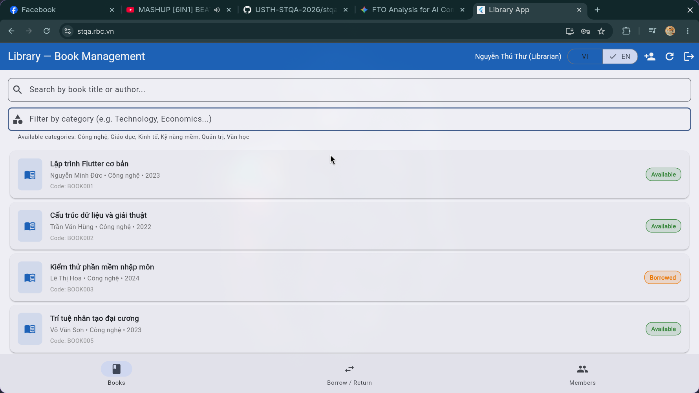 |  |
| TC-11 | View Book List | Member can view the list of all books with complete information: title, author, category, year, code, status. | List of all book with full information | Pass | 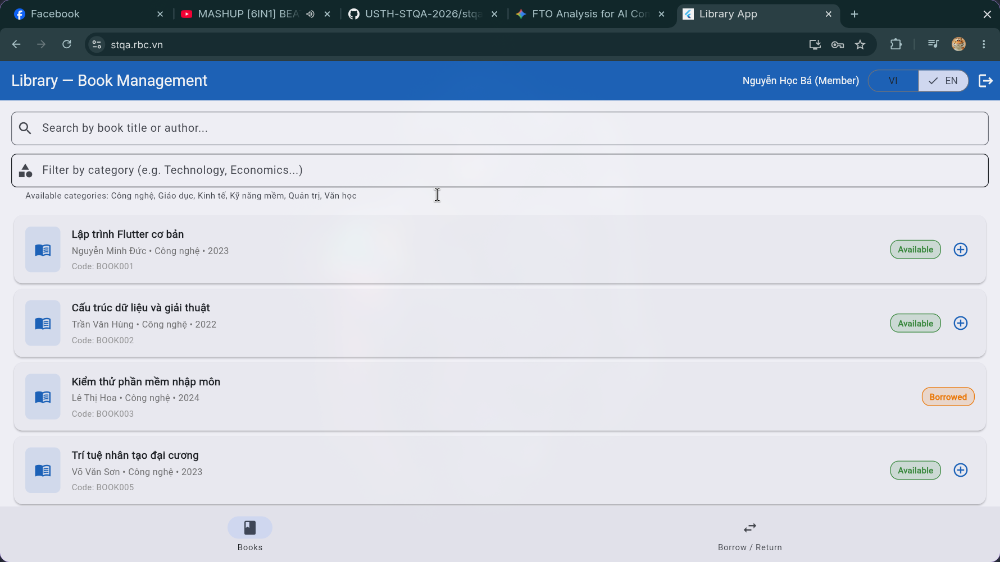 |  |
| TC-12 | View Book List | A book with status "Available" is displayed correctly (e.g., BOOK001 shows "Available"). | Book code "BOOK001" is "available" | Pass | 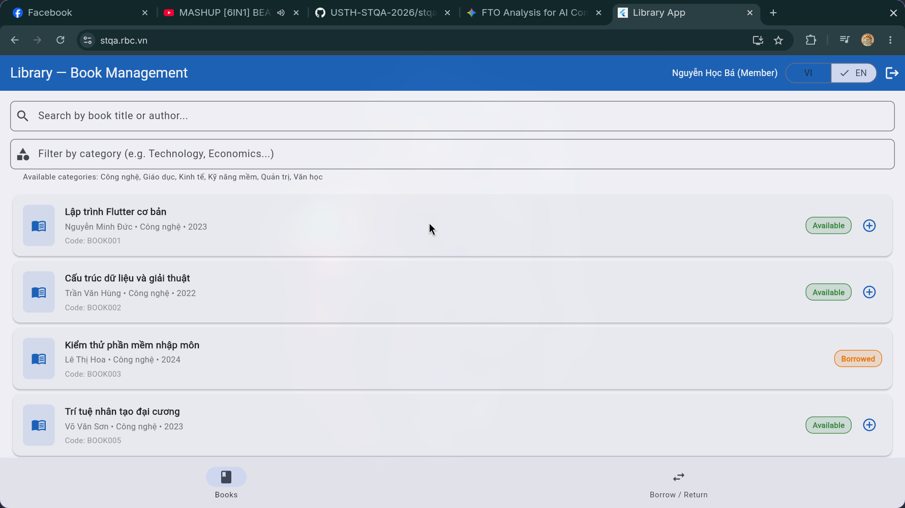 |  |
| TC-13 | View Book List | A book with status "Borrowed" is displayed correctly (e.g., BOOK003 shows "Borrowed"). | "BOOK03" show "Borrowed" | Pass | 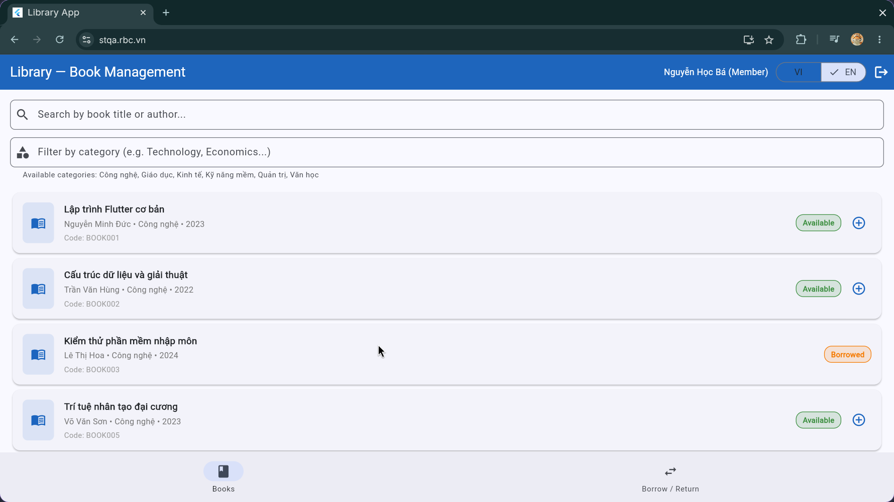 |  |
| TC-14 | View Book List | After borrowing a book, its status updates immediately from "Available" to "Borrowed". | "BOOK001" show "borrowed" | Pass |   |  |
| TC-15 | View Book List | After returning a book, its status updates immediately from "Borrowed" to "Available". | "BOOK003" show "available" | Pass | 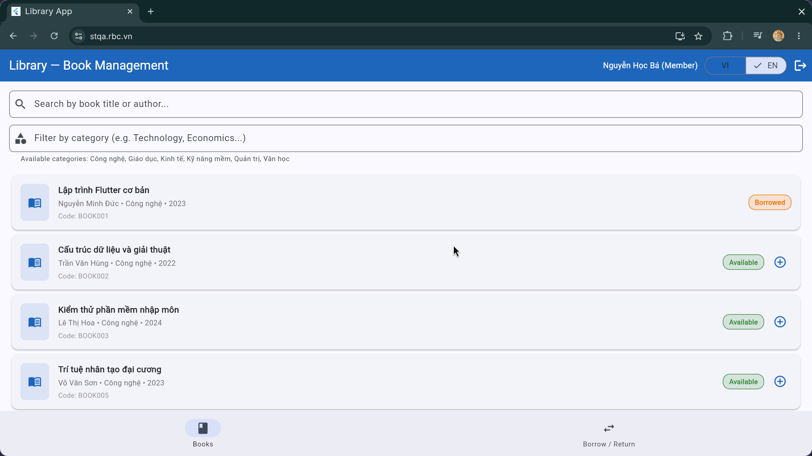 |  |
| TC-16 | View Book List | Publication year is shown in a valid 4-digit format and is not empty for every book. | No year display invalid | Pass |  |  |
| TC-16 | View Book List | Publication year is shown in a valid 4-digit format and is not empty for every book. | No year display invalid | Pass |  |  |
| TC-17 | View Book List | Verify that a book with Lost status is displayed correctly | "BOOK007" show "Lost" | Pass | 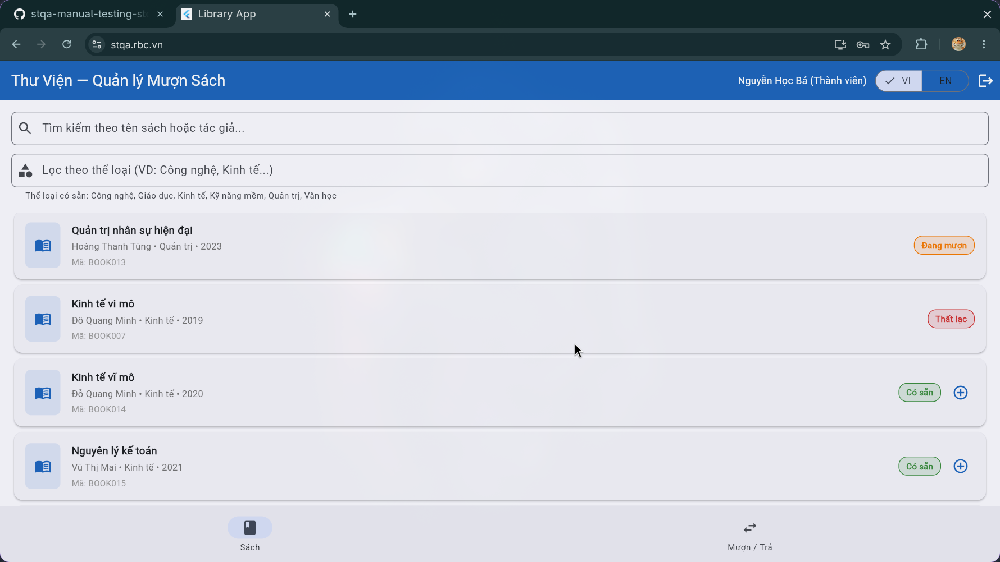 |  |

### REQ-03: Search & Filter
| TC ID | Functional group | Expected result (summary) | Actual result | Conclusion | Evidence | Bug |
|-------|------------------|---------------------------|---------------|-----------|----------|-----| 
| TC-18 | Search & Filter | Search by valid book title (e.g., "Flutter") returns books whose titles contain the keyword. | display all book have 'Flutter' in title | Pass |  |  |
| TC-19 | Search & Filter | Search using lowercase keyword ("flutter") still returns matching books (case-insensitive). | display all book have 'flutter' in title | Pass | 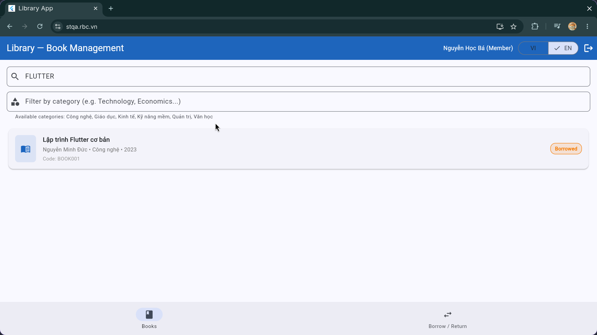 |  |
| TC-20 | Search & Filter | Search using uppercase keyword ("FLUTTER") returns matching books (case-insensitive). | display all book have 'FLUTTER' in title | pass |  |  |
| TC-21 | Search & Filter | Search by author name (e.g., "Nguyễn Minh Đức") returns books by that author. | display all book that have author is "Nguyễn Minh Đức" | Pass |  |  |
| TC-22 | Search & Filter | Searching with a non-existing keyword ("XYZ123") shows "No books found". | Display "No books found" in the center screen | Pass | 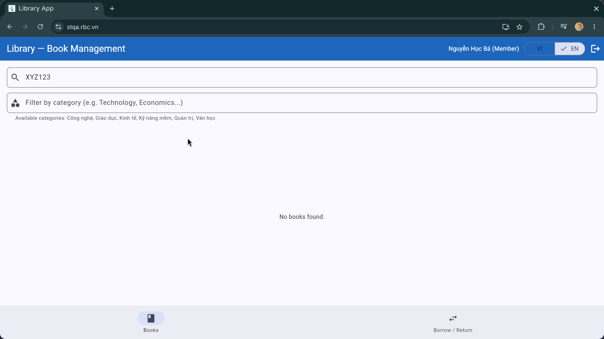 |  |
| TC-23 | Search & Filter | Display book with title: "Nhập môn lập trình Python" | Display book with title: "Nhập môn lập trình Python" | Pass |  |  |
| TC-24 | Search & Filter | Notification "No book found" in the center screen | Notification "No book found" in the center screen | Failed |  | BUG-05 |
| TC-25 | Search & Filter | Display all books with title has "F" | Display all books with title has "F" | Pass | 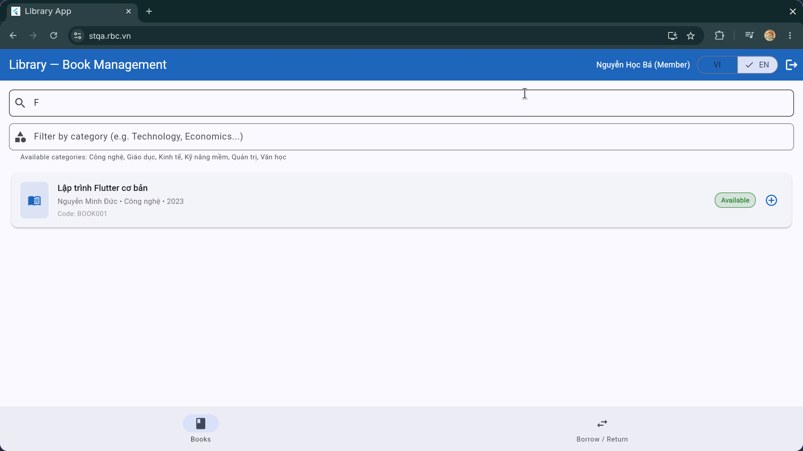 |  |
| TC-26 | Search & Filter | Display all books that have category "Công nghệ" | Display all books that have category "Công nghệ" | Pass | 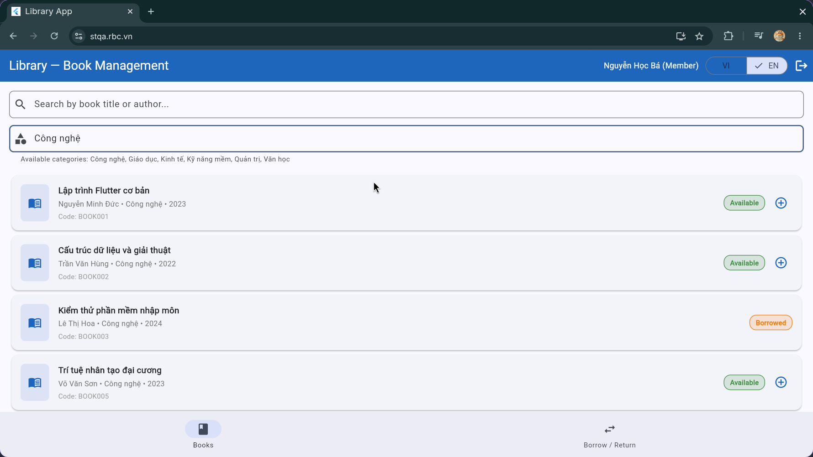 | |
| TC-27 | Search & Filter | Display book with title: "Nhập môn lập trình Python" | Display all book with category "Công nghệ" | Failed |  | BUG-05 |

### REQ-4 Borrow Book
| Mã TC | Nhóm chức năng | Kết quả mong đợi (tóm tắt) | Kết quả thực tế | Kết luận | Minh chứng | Bug |
|-------|---------------|---------------------------|-----------------|---------|-----------|----| 
| TC-28 | Borrow Book | Successfull message and new borrow record | Displays a success message. A borrow record is created with a due date set to exactly +14 days from today | Pass | 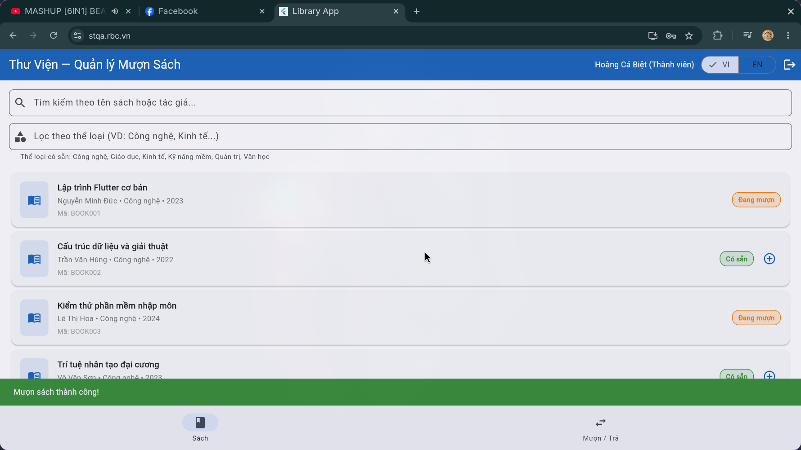 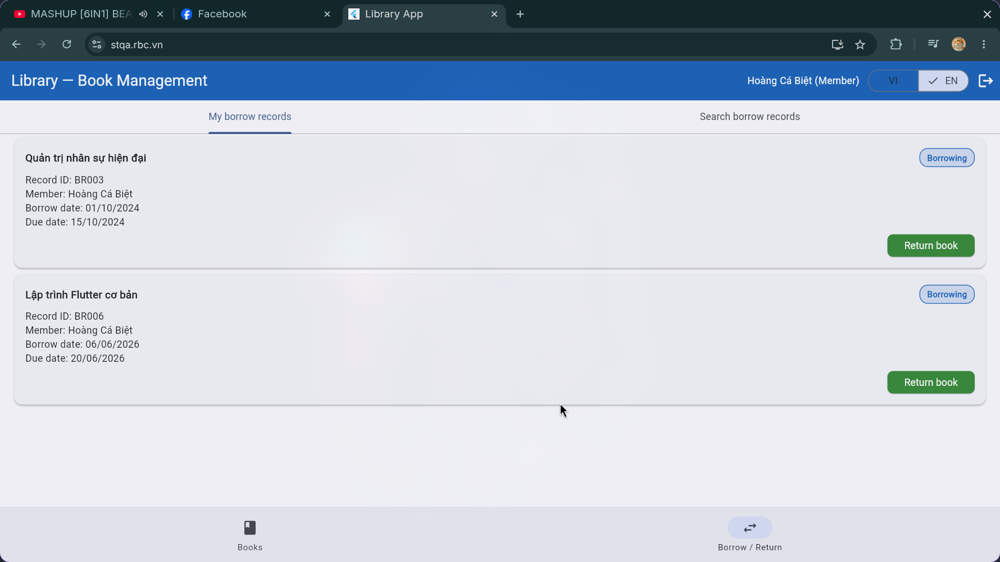| |
| TC-29 | Borrow Book | Reject the third try to borrow book | Successfull message and a new borrow record | Failed |  | BUG-08 | 
| TC-30 | Borrow Book | Reject request and display "suspended" message | The system rejects the request and displays a specific error message for the "Expired" account status | Failed |  | BUG-09 |
| TC-31 | Borrow Book | "+" button is hidden and book status is `borrowed` | The "+" borrow button is completely hidden/disabled for this book and status is "Borrowed" | Pass | 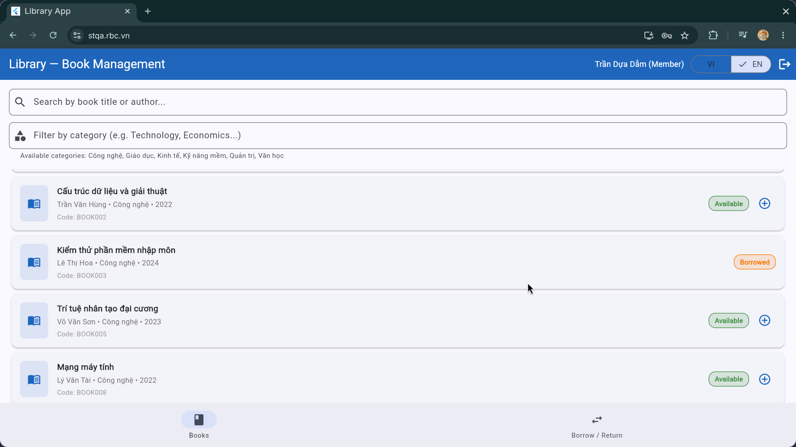 |
| TC-32 | Borrow Book | Display error messge | The system rejects the request and displays a specific error message for the "Expired" account status | Pass | 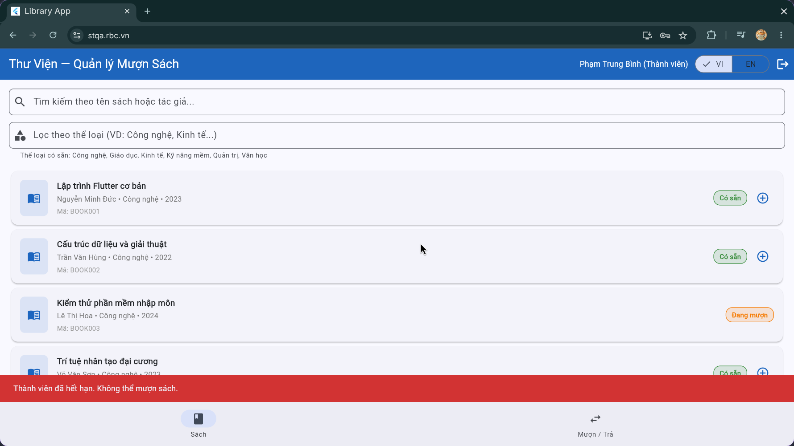 |
| TC-33 | Borrow Book | "+" button is hidden and book status is `lost` | The "+" borrow button is completely hidden/disabled and status is "Lost" | Pass | 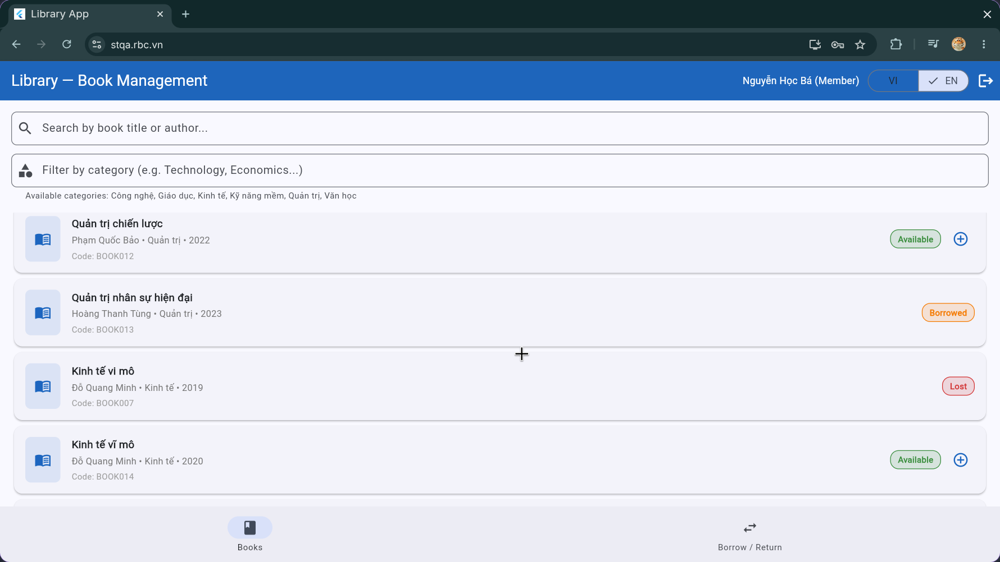 |

### REQ-5 Return Book
| Mã TC | Nhóm chức năng | Kết quả mong đợi (tóm tắt) | Kết quả thực tế | Kết luận | Minh chứng | Bug |
|-------|---------------|---------------------------|-----------------|---------|-----------|----| 
| TC-34 | Return Book | success message, status into "Available" | 1.Success message shown. 2.Record status "Returned". 3.BOOK001 status -> "Available". 4.No overdue warning | Pass | 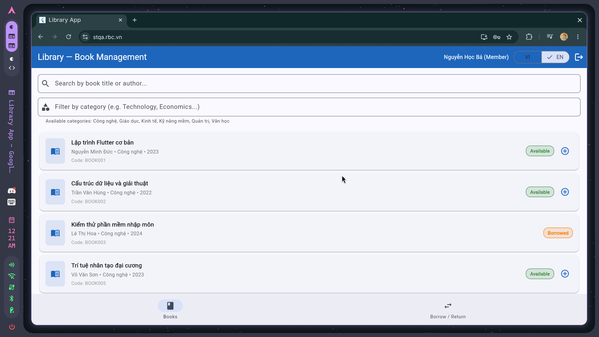 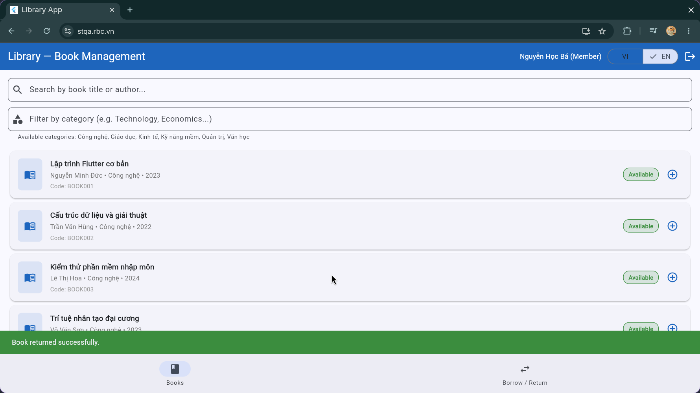 |
| TC-35 | Return Book | 1. Return is accepted. 2. BR001 status -> "Returned". 3. BOOK003 status -> "Available" | 1. Return is accepted. 2. BR001 status is "Returned". 3. BOOK003 status is "Available" | Pass | 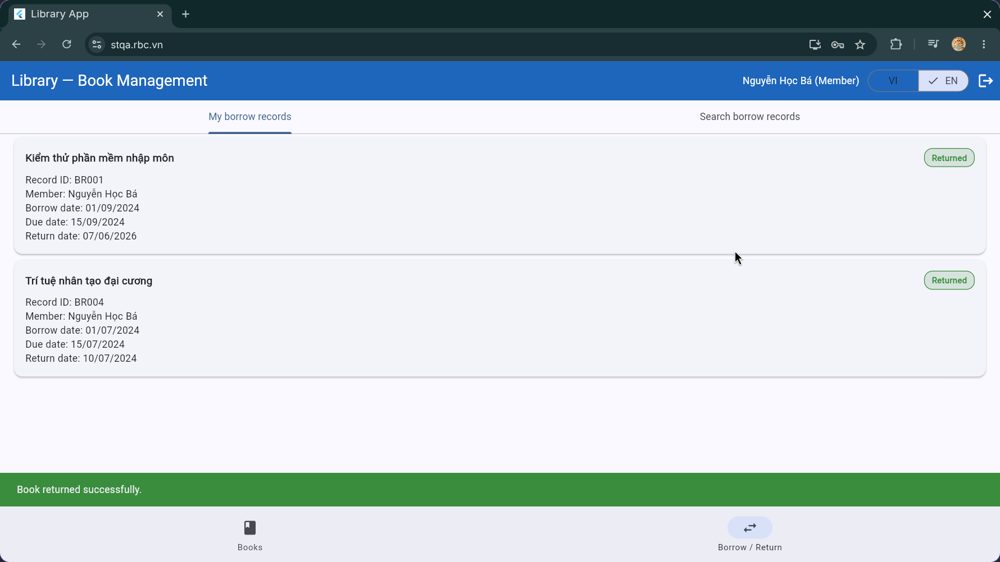 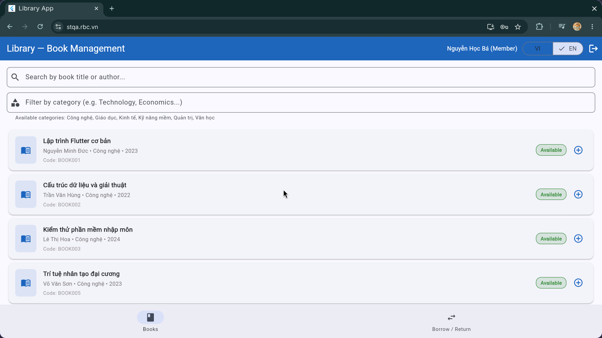 |
| TC-36 | Return Book | Can not find `"BOOK013"`, no "return" button | 1. Cannot find BOOK013 in MEM002's list. 2. No "Return" button available for BOOK013. |Pass | 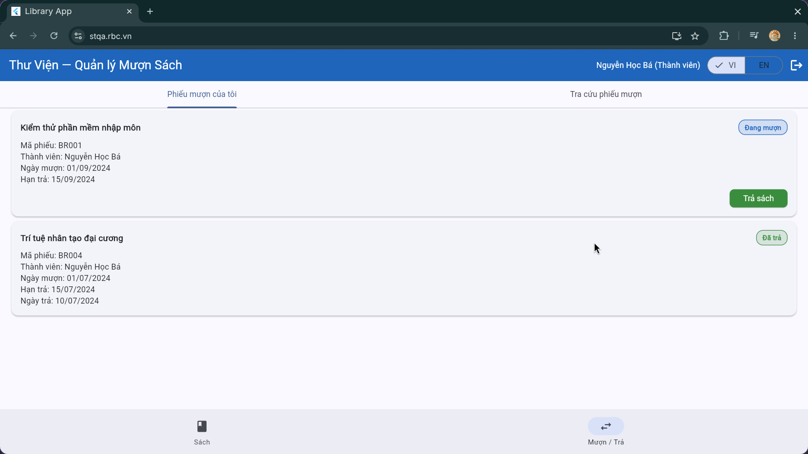 |
| TC-37 | Return Book | 1. Before return: BOOK003 = "Borrowed". 2. After return: BOOK003 = "Available" | 1. Before return: BOOK003 = "Borrowed". 2. After return: BOOK003 = "Available" | Pass |   |
| TC-38 | Return Book | Success message | displaying only one popup message: "Book returned successfully" | Pass | 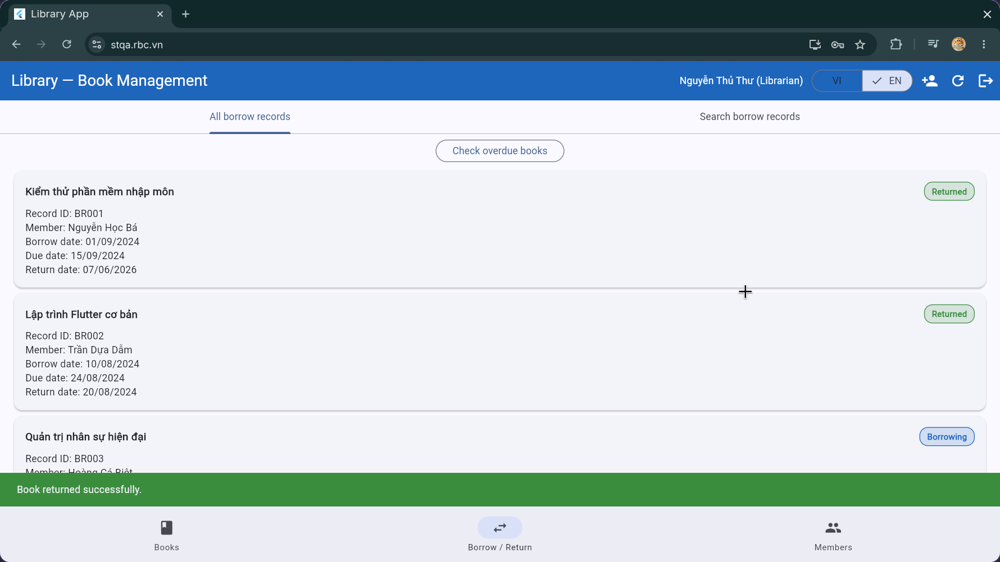 |
| TC-39 | Return Book | Warning on screen | System does not display anything | Failed |  | BUG-10 |

### REQ-6 Overdue Handling
| Mã TC | Nhóm chức năng | Kết quả mong đợi (tóm tắt) | Kết quả thực tế | Kết luận | Minh chứng | Bug |
|-------|---------------|---------------------------|-----------------|---------|-----------|----| 
| TC-40 | Overdue Handling | Success message | Display "updated: 2 overdue book" | Pass | 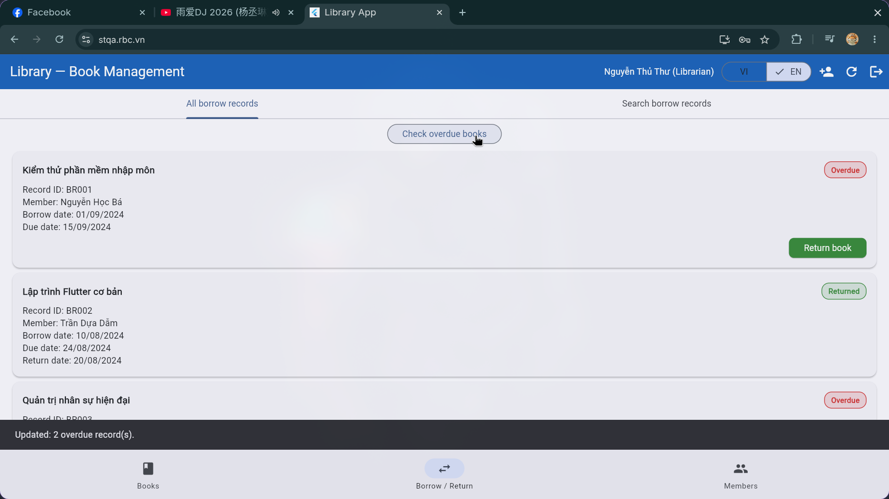 |
| TC-41 | Overdue Handling | status "borrowed" -> "overdue" | Book status for borrowed items changes from 'Borrowed' to 'Overdue' | Pass | 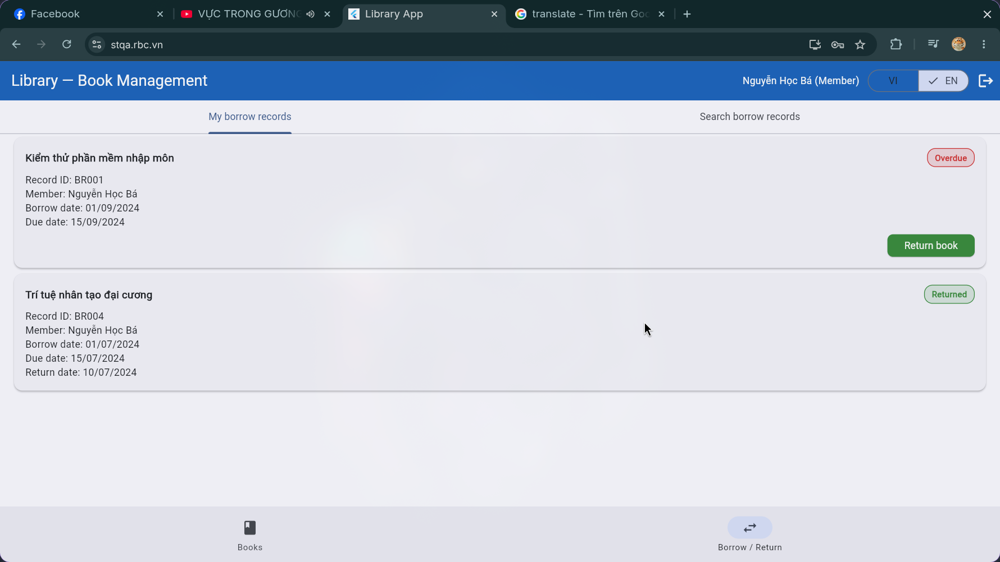 | |

### REQ-7 Manage Member (Add new)
| Mã TC | Nhóm chức năng | Kết quả mong đợi (tóm tắt) | Kết quả thực tế | Kết luận | Minh chứng | Bug |
|-------|---------------|---------------------------|-----------------|---------|-----------|----| 
| TC-42 | Manage Member (Add new) | Create new member with success message | Show error message: "Invalid email" | Failed |  | BUG-03 |
| TC-43 | Manage Member (Add new) | No "add member" icon | No "add member" icon | Pass | 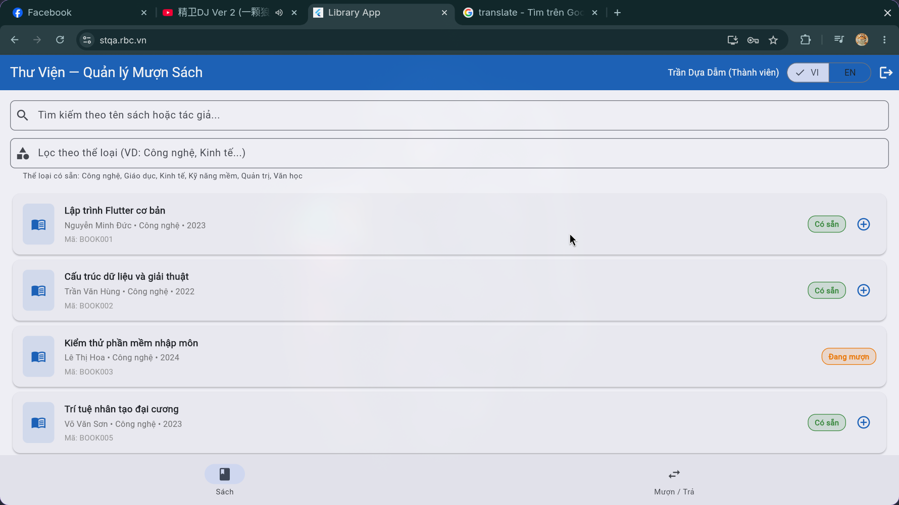 |
| TC-44 | Manage Member (Add new) | Error message about fields blank | Display error message "Fullname is not blank" | Failed | |
| TC-45 | Manage Member (Add new) | Error message | Display success message | Failed|| BUG-02 |
| TC-46 | Manage Member (Add new) | Error message | Display message: "Invalid email" | Pass | 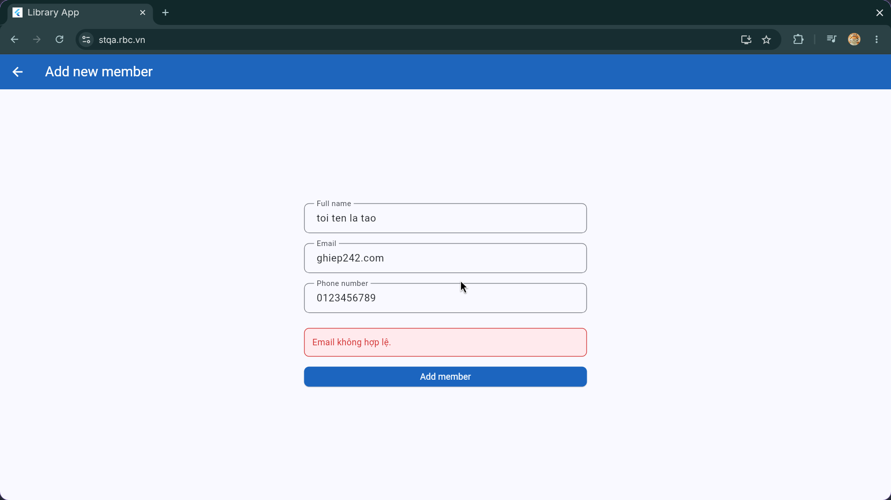 | |
| TC-47 | Manage Member (Add new) | Error message like "This email already exists" | Display message: "Invalid email" | Failed |  | BUG-03|
| TC-48 | Manage Member (Add new) | List members with full information | List full member, full information | Pass | 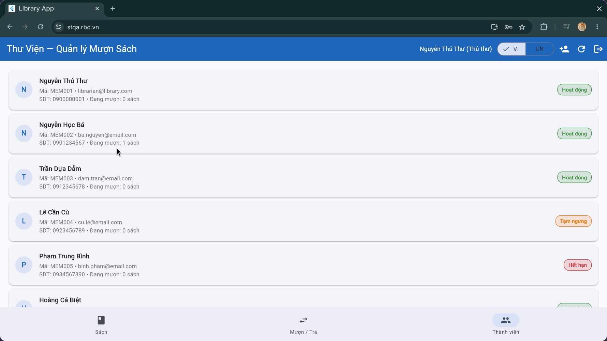 | |

### REQ-8 - Borrow Receipt Lookup
| Mã TC | Nhóm chức năng | Kết quả mong đợi (tóm tắt) | Kết quả thực tế | Kết luận | Minh chứng | Bug |
|-------|---------------|---------------------------|-----------------|---------|-----------|----| 
|TC-49| Borrow Receipt Lookup | List borrow receipts with full information | List borrow receipts with full information | Pass | 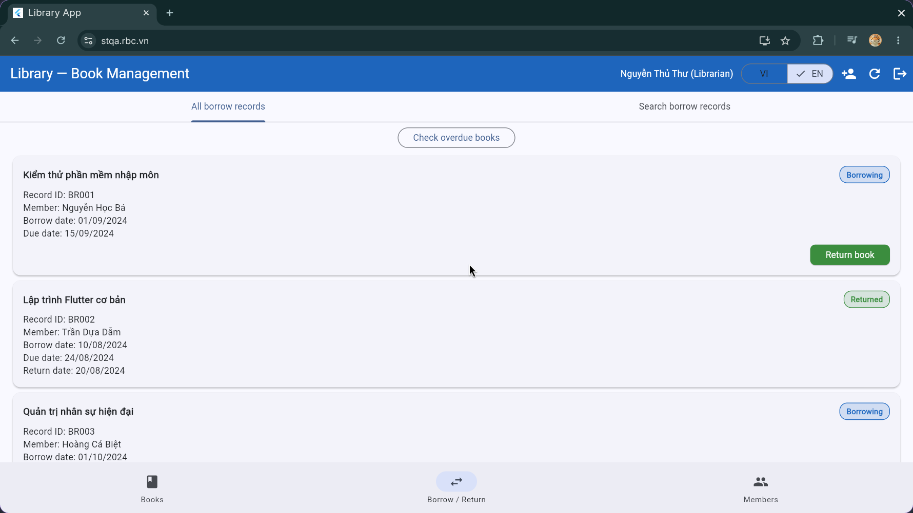 |  |
| TC-50 | Borrow Receipt Lookup | List borrow receipts with full information | List borrow receipts with full information | Pass | 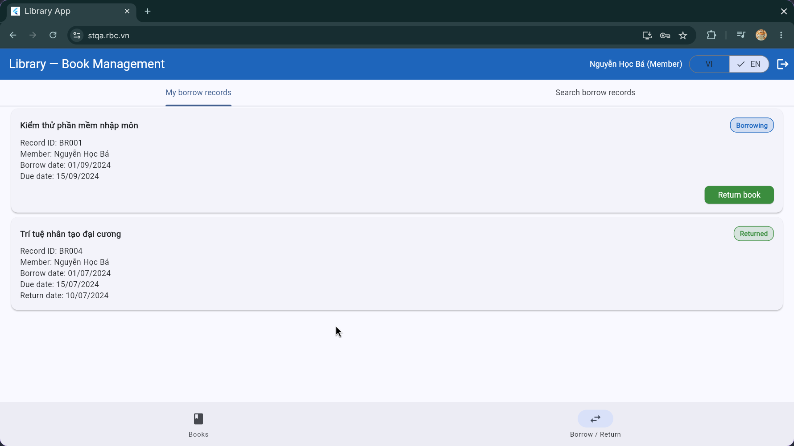 |  |

---

## Results Summary

| Metric | Value |
|--------|---------|
| Total Test Cases | `50` |
| Pass | `39` |
| Fail | `11` |
| Blocked | `0` |
| Not Run | `0` |
| **Pass Rate** | `78.00%` |

### Results by Functional Group

| Group | Total TC | Pass | Fail | Pass Rate |
|------|---------|------|------|------------|
| REQ-01: Login | 9 | 5 | 4 | 55.56% |
| REQ-02: View Book List | 9 | 9 | 0 | 100.00% |
| REQ-03: Search & Filter | 10 | 8 | 2 | 80.00% |
| REQ-04: Borrow Book | 6 | 4 | 2 | 66.67% |
| REQ-05: Return Book | 6 | 5 | 1 | 83.33% |
| REQ-06: Overdue Handling | 2 | 2 | 0 | 100.00% |
| REQ-07: Manage Member (Add new) | 7 | 3 | 4 | 42.86% |
| REQ-08: Borrow Receipt Lookup | 2 | 2 | 0 | 100.00% |
