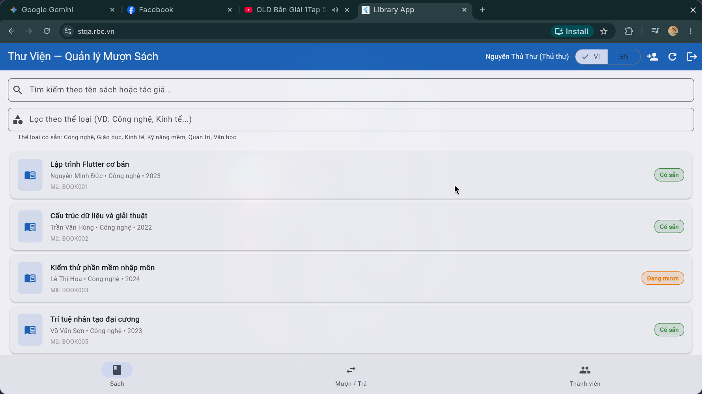
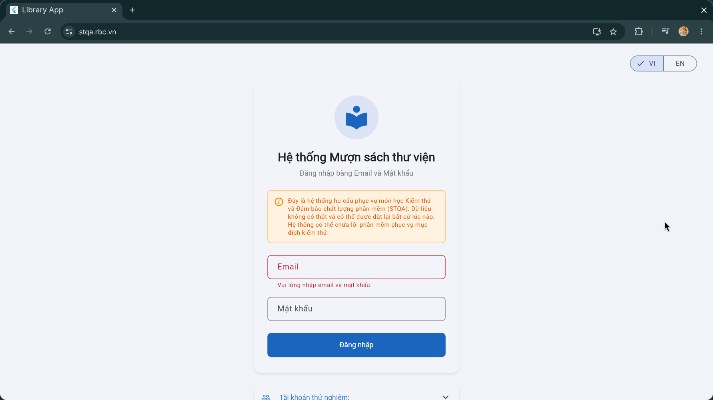
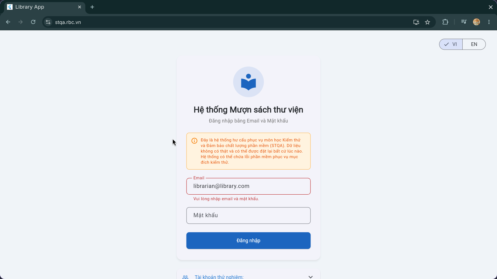
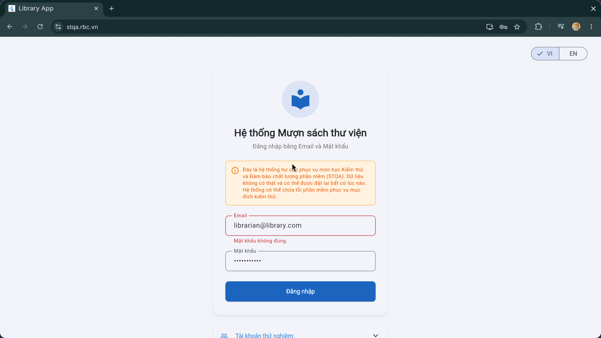
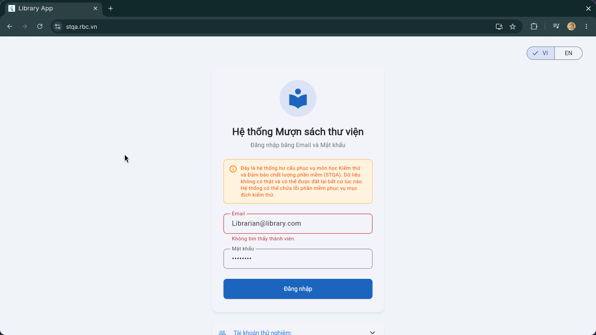
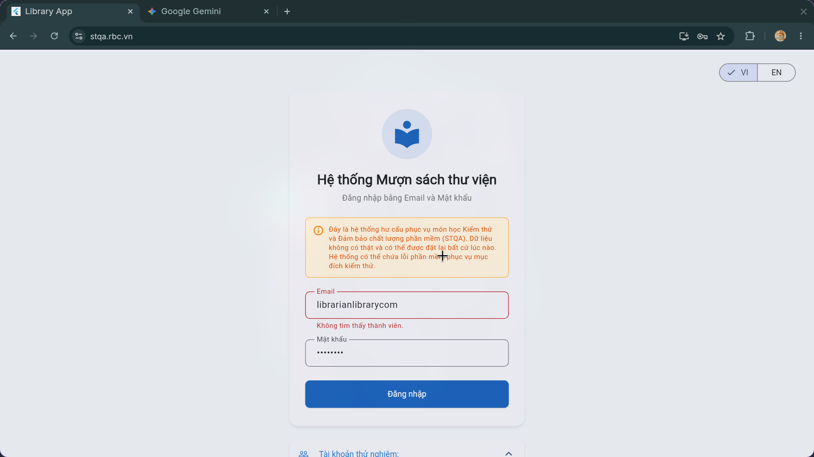
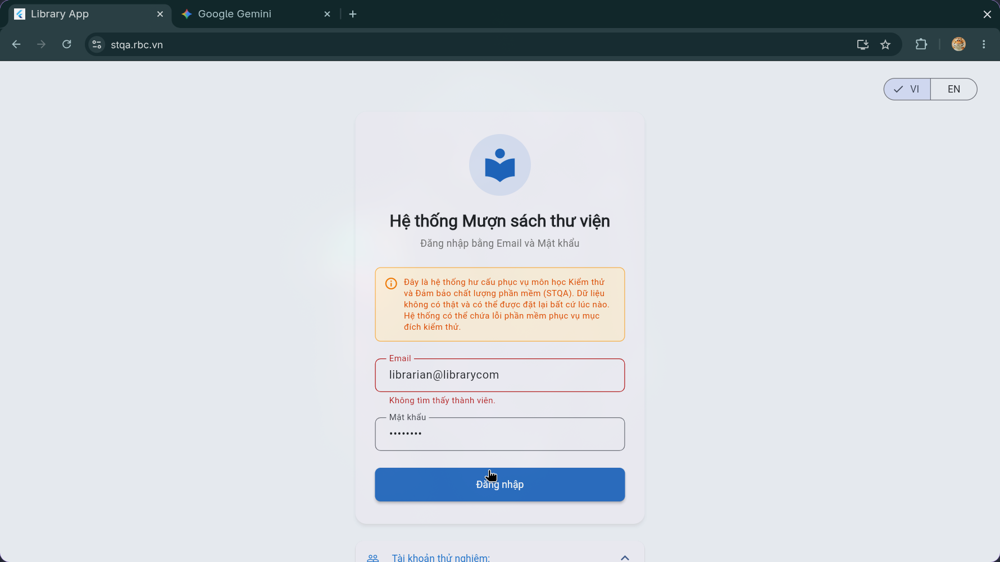
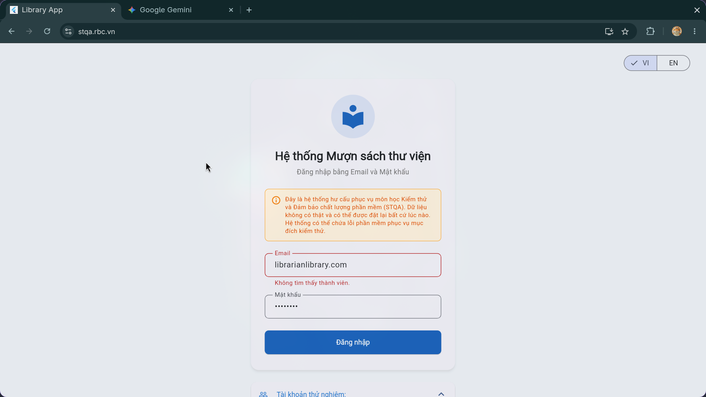

# Test Execution — Kết quả thực thi kiểm thử

> **Hướng dẫn**: Chạy từng TC trên hệ thống https://stqa.rbc.vn, ghi lại kết quả thực tế.
> Kết luận: **Pass** (kết quả đúng), **Fail** (kết quả sai → tạo bug report), **Blocked** (không thực hiện được vì lỗi khác chặn), **Not Run** (chưa chạy).

| Thông tin | |
|---|---|
| **Nhóm** | `STQA Group 10` |
| **Ngày thực thi** | `5/6/2026` |
| **Trình duyệt** | Chrome `<!-- version -->` |
| **Hệ điều hành** | `Linux` |

---

## Kết quả chi tiết
### REQ-01: Login
| Mã TC | Nhóm chức năng | Kết quả mong đợi (tóm tắt) | Kết quả thực tế | Kết luận | Minh chứng | Bug |
|-------|---------------|---------------------------|-----------------|---------|-----------|----| 
| TC-01 | Login | 1. Redirect to homepage successfully.  2. App bar correctly displays admin information | 1. Redirect to homepage successfully.  2. App bar correctly displays user name and role: Nguyễn Thủ Thư (Librarian). | Pass | | |
| TC-02 | Login | System displays error message | System displays error message: "Please enter email and password" | Pass |  | |
| TC-03 | Login | System blocks login and displays an error message | System displays error message: "Please enter email and password" | Pass |  | |
| TC-04 | Login | System displays error message: "Incorrect password" | System displays error message: "Incorrect password" | Pass |  | |
| TC-05 | Login | Login successfully | System displays error message: "Not find member" | Failed |  | BUG-01 |
| TC-06 | Login | Password is hidden by "*" or other symbols | Password is hidden by dots | Pass |  | |
| TC-07 | Login | System displays "Email or password is invalid" | System displays "Can not find member" | Failed |  |
| TC-08 | Login | System displays "Email or password is invalid" | System displays "Can not find member" | Failed |  |
| TC-09 | Login | System displays "Email or password is invalid" | System displays "Can not find member" | Failed |  |

### REQ-2
| Mã TC | Nhóm chức năng | Kết quả mong đợi (tóm tắt) | Kết quả thực tế | Kết luận | Minh chứng | Bug |
|-------|---------------|---------------------------|-----------------|---------|-----------|----| 
| TC-09 | View Book List | 

### REQ-3
| Mã TC | Nhóm chức năng | Kết quả mong đợi (tóm tắt) | Kết quả thực tế | Kết luận | Minh chứng | Bug |
|-------|---------------|---------------------------|-----------------|---------|-----------|----| 

### REQ-4
| Mã TC | Nhóm chức năng | Kết quả mong đợi (tóm tắt) | Kết quả thực tế | Kết luận | Minh chứng | Bug |
|-------|---------------|---------------------------|-----------------|---------|-----------|----| 

### REQ-5
| Mã TC | Nhóm chức năng | Kết quả mong đợi (tóm tắt) | Kết quả thực tế | Kết luận | Minh chứng | Bug |
|-------|---------------|---------------------------|-----------------|---------|-----------|----| 

### REQ-6
| Mã TC | Nhóm chức năng | Kết quả mong đợi (tóm tắt) | Kết quả thực tế | Kết luận | Minh chứng | Bug |
|-------|---------------|---------------------------|-----------------|---------|-----------|----| 

### REQ-7
| Mã TC | Nhóm chức năng | Kết quả mong đợi (tóm tắt) | Kết quả thực tế | Kết luận | Minh chứng | Bug |
|-------|---------------|---------------------------|-----------------|---------|-----------|----| 

### REQ-8
| Mã TC | Nhóm chức năng | Kết quả mong đợi (tóm tắt) | Kết quả thực tế | Kết luận | Minh chứng | Bug |
|-------|---------------|---------------------------|-----------------|---------|-----------|----| 

---

## Tổng hợp kết quả

| Chỉ số | Giá trị |
|--------|---------|
| Tổng số test case | `<!-- số -->` |
| Pass | `<!-- số -->` |
| Fail | `<!-- số -->` |
| Blocked | `<!-- số -->` |
| Not Run | `<!-- số -->` |
| **Tỷ lệ Pass** | `<!-- xx% -->` |

### Kết quả theo nhóm chức năng

| Nhóm | Tổng TC | Pass | Fail | Tỷ lệ Pass |
|------|---------|------|------|------------|
| | | | | |
